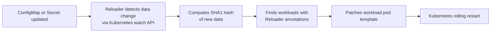

# How Reloader Works

Reloader is a Kubernetes controller that watches `ConfigMaps` and `Secrets` for data changes and triggers rolling restarts of workloads that depend on them.

This page explains the internal mechanics: how changes are detected, how workloads are identified, and how restarts are triggered.

---

## Overview



---

## Step 1 — Change detection

Reloader uses the Kubernetes watch API to receive real-time events for `ConfigMap` and `Secret` resources.

When an update event arrives, Reloader compares the **old** and **new** versions of the object. It only proceeds if the **data** actually changed — metadata-only changes (labels, annotations) do not trigger a restart.

This prevents unnecessary restarts from administrative operations.

---

## Step 2 — Hash computation

When a data change is confirmed, Reloader computes a **SHA1 hash** of the updated resource's data. SHA1 is used because it produces a compact 40-character value and is efficient for this use case.

The hash represents the state of the resource at the time of the change.

---

## Step 3 — Workload matching

Reloader scans all workloads across watched namespaces and identifies those that should be restarted based on their annotations. See the [Annotation Reference](../reference/annotations.md) for the full set of supported annotations.

A workload matches if:

- It has `reloader.stakater.com/auto: "true"` and references the changed resource in its pod spec
- It has `secret.reloader.stakater.com/reload` or `configmap.reloader.stakater.com/reload` naming the changed resource explicitly
- It has `reloader.stakater.com/search: "true"` and the changed resource has `reloader.stakater.com/match: "true"`

---

## Step 4 — Workload restart

Reloader patches the pod template of the matching workload. The patch method depends on the configured [reload strategy](#reload-strategies).

Once the pod template is patched, Kubernetes detects the spec change and initiates a rolling update according to the workload's own `RollingUpdate` strategy. Reloader does not restart pods directly — it delegates the actual rollout to Kubernetes.

---

## Reload strategies

Reloader supports two strategies for patching the pod template.

### `env-vars` (default)

Reloader injects or updates an environment variable on each container in the pod template. The variable name is derived from the changed resource:

| Resource type | Environment variable name |
|---|---|
| ConfigMap named `foo` | `STAKATER_FOO_CONFIGMAP` |
| Secret named `bar` | `STAKATER_BAR_SECRET` |
| ConfigMap named `my-config` | `STAKATER_MY_CONFIG_CONFIGMAP` |
| Secret named `db-credentials` | `STAKATER_DB_CREDENTIALS_SECRET` |

The name is converted to uppercase and any character that is not `A–Z` or `0–9` (including hyphens and dots) is replaced with `_`.

The variable value is the SHA1 hash of the resource's data. When the data changes, the hash changes, the environment variable is updated, and Kubernetes detects the pod template diff and initiates a rolling restart.

If the environment variable already exists with the same hash value, no update is performed and no restart is triggered.

### `annotations`

Instead of injecting an environment variable, Reloader adds the annotation `reloader.stakater.com/last-reloaded-from` to the pod template metadata. The annotation value is the name of the resource that triggered the reload.

This strategy is preferred when using GitOps tools such as Argo CD, because environment variable injection can cause Argo CD to detect drift between the live state and the desired state in Git.

Configure via Helm:

```yaml
reloader:
  reloadStrategy: annotations
```

---

## Supported workload types

| Workload type | Notes |
|---|---|
| `Deployment` | Fully supported |
| `StatefulSet` | Fully supported |
| `DaemonSet` | Fully supported |
| `Argo Rollout` | Requires `reloader.isArgoRollouts: true` |
| `CronJob` | Supported; can be disabled with `reloader.ignoreCronJobs: true` |
| `Job` | Supported; can be disabled with `reloader.ignoreJobs: true` |
| `DeploymentConfig` | OpenShift only; auto-detected when running on OpenShift |

---

## Helm compatibility

Reloader is fully compatible with Helm-managed workloads. When Reloader patches a workload, it only modifies the environment variable or annotation it controls. The next `helm upgrade` will not undo Reloader's changes — Helm will simply see the Reloader-injected value as part of the live state and continue managing everything else normally.

---

## Namespace scope

By default Reloader watches all namespaces in the cluster (`reloader.watchGlobally: true`).

To restrict Reloader to the namespace it is deployed in:

```yaml
reloader:
  watchGlobally: false
```

To watch only namespaces matching a label selector:

```yaml
reloader:
  namespaceSelector: "environment=production"
```
