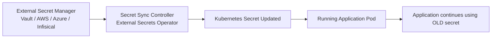

# The Secret Propagation Problem in Kubernetes

Modern Kubernetes platforms commonly retrieve secrets and configuration from external systems such as:

* HashiCorp Vault
* OpenBao
* AWS Secrets Manager
* Azure Key Vault
* Google Secret Manager
* Infisical

These systems usually synchronize secrets into Kubernetes using controllers such as:

* External Secrets Operator
* Secrets Store CSI Driver

While these tools successfully bring secrets into Kubernetes, they introduce an important operational gap.

---

## The Core Limitation

Kubernetes **does not automatically restart workloads** when a `Secret` or `ConfigMap` changes.

This means:

* Applications may continue running with **outdated configuration**
* Rotated credentials may **not be applied immediately**
* Secret rotation workflows become **incomplete**

Even though the updated secret exists in the cluster, running applications may continue using the old value until they are manually restarted or redeployed.

---

## Example Scenario

Consider a typical secret rotation workflow:

1. A database password rotates in a secret manager.
2. A synchronization controller updates the Kubernetes `Secret`.
3. The application deployment is **not restarted automatically**.

As a result:

* The application continues using the **old database password**
* Authentication may fail when the old credential expires
* Security policies requiring immediate secret rotation are not satisfied

---

## Secret Propagation Without Reloader

Even though the secret is updated, the running application does not automatically reload it.

---

## Why This Happens

In Kubernetes:

* Secrets and ConfigMaps are **mounted into pods at startup**
* When they change, Kubernetes **does not trigger a rollout**
* Pods must be restarted to pick up the new values

This behavior is intentional because Kubernetes avoids automatically restarting workloads when configuration changes.

However, this creates a **configuration propagation gap**.

---

## The Secret Propagation Gap

Without automation, teams often rely on:

* manual `kubectl rollout restart`
* CI/CD pipeline scripts
* Helm checksum annotations
* custom operators
* manual intervention

These approaches can lead to:

* inconsistent behavior
* operational overhead
* human error
* missed secret rotations

---

## Closing the Gap with Reloader

Reloader solves the propagation problem by automatically restarting workloads when their configuration changes.

It continuously watches for changes in:

* Kubernetes `Secrets`
* Kubernetes `ConfigMaps`

When a change is detected, Reloader triggers a rolling restart of the workloads that depend on those resources.

---

## Secret Propagation With Reloader

With Reloader in place:

* Secret rotation becomes effective immediately
* Applications automatically load updated credentials
* Operational consistency improves
* Configuration drift is reduced

---

## Benefits of Automated Configuration Reloading

Using Reloader provides several operational advantages:

**Immediate configuration propagation**

Applications always run with the latest secrets and configuration.

**Improved security posture**

Rotated credentials are enforced without delay.

**Simplified operations**

Teams no longer need manual restart procedures or pipeline scripts.

**Better GitOps workflows**

Configuration changes can remain independent of deployment manifests.

**Reduced operational risk**

Automated restarts eliminate human error during secret rotation.

---

## When This Problem Commonly Appears

The propagation gap is commonly encountered in environments using:

* secret rotation policies
* GitOps-based deployments
* certificate management systems
* dynamic credential systems
* external secret managers

Typical examples include:

* database credential rotation
* TLS certificate renewal
* API key updates
* OAuth client secret rotation
* service mesh certificate updates

---

## Summary

Kubernetes provides strong primitives for configuration management, but it does not automatically propagate configuration changes into running workloads.

Reloader fills this gap by ensuring that when a `Secret` or `ConfigMap` changes, the workloads that depend on them are automatically restarted.

This creates a complete and reliable configuration propagation workflow for modern Kubernetes platforms.
