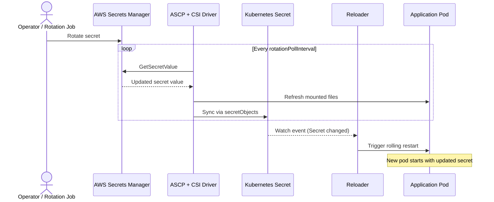

# How to Use Reloader with AWS Secrets Manager and CSI Driver

This guide shows how to mount secrets from AWS Secrets Manager into Kubernetes pods using the AWS Secrets and Configuration Provider (ASCP) and the Secrets Store CSI Driver, then use Reloader to automatically restart pods when those secrets change.

The ASCP syncs secrets into a Kubernetes `Secret` via `secretObjects`. Reloader watches that Kubernetes Secret and triggers a rolling restart whenever it is updated.

> **See also:** [ESO Pattern](aws-eso.md) — if you are already using External Secrets Operator, that pattern requires no CSI Driver.

---

## How It Works



---

## Prerequisites

- Amazon EKS cluster (Kubernetes 1.17+)
- AWS CLI configured locally
- Helm v3+
- An existing secret in AWS Secrets Manager
- Stakater Reloader installed
- OIDC provider associated with the cluster (for IRSA authentication)

---

## Step 1 — Install the Secrets Store CSI Driver

The CSI Driver must have `syncSecret.enabled=true` so that the ASCP can sync secrets into Kubernetes Secret objects.

```bash
helm repo add secrets-store-csi-driver https://kubernetes-sigs.github.io/secrets-store-csi-driver/charts
helm repo update
helm install csi-secrets-store secrets-store-csi-driver/secrets-store-csi-driver \
  --namespace kube-system \
  --set syncSecret.enabled=true \
  --set enableSecretRotation=true \
  --set rotationPollInterval=3600s
```

`rotationPollInterval=3600s` is a recommended starting point. AWS charges per API call to Secrets Manager; shorter intervals increase cost.

---

## Step 2 — Install the AWS Secrets and Configuration Provider (ASCP)

```bash
helm repo add aws-secrets-manager https://aws.github.io/secrets-store-csi-driver-provider-aws
helm repo update
helm install -n kube-system secrets-provider-aws \
  aws-secrets-manager/secrets-store-csi-driver-provider-aws
```

---

## Step 3 — Install Reloader

```bash
helm repo add stakater https://stakater.github.io/stakater-charts
helm repo update
helm install reloader stakater/reloader \
  --namespace reloader \
  --create-namespace
```

---

## Step 4 — Create an IAM policy

Create an IAM policy that allows the pod to read secrets from Secrets Manager.

```bash
aws iam create-policy \
  --policy-name ReloaderASCPPolicy \
  --policy-document '{
    "Version": "2012-10-17",
    "Statement": [{
      "Effect": "Allow",
      "Action": [
        "secretsmanager:GetSecretValue",
        "secretsmanager:DescribeSecret"
      ],
      "Resource": "arn:aws:secretsmanager:<region>:<account-id>:secret:<secret-name>-*"
    }]
  }'
```

Replace `<region>`, `<account-id>`, and `<secret-name>` with your values. The trailing `-*` accounts for the random suffix AWS appends to secret ARNs.

---

## Step 5 — Set up IRSA (IAM Roles for Service Accounts)

IRSA is the recommended authentication method for EKS. It binds an IAM role to a Kubernetes ServiceAccount using OIDC federation, so no static credentials are stored in the cluster.

### Associate the OIDC provider with your cluster

```bash
eksctl utils associate-iam-oidc-provider \
  --cluster <cluster-name> \
  --approve
```

### Create an IAM role for the service account

```bash
eksctl create iamserviceaccount \
  --name ascp-sa \
  --namespace default \
  --cluster <cluster-name> \
  --attach-policy-arn arn:aws:iam::<account-id>:policy/ReloaderASCPPolicy \
  --approve \
  --override-existing-serviceaccounts
```

This creates the `ascp-sa` ServiceAccount in the `default` namespace, annotated with the IAM role ARN:

```yaml
metadata:
  annotations:
    eks.amazonaws.com/role-arn: arn:aws:iam::<account-id>:role/eksctl-<cluster>-addon-iamserviceaccount-Role
```

---

## Step 6 — Create the SecretProviderClass

The `SecretProviderClass` defines which secrets to fetch from Secrets Manager and how to sync them into a Kubernetes Secret via `secretObjects`.

### Option A — JSON secret (use `jmesPath` to extract individual fields)

If your secret is stored as a JSON string (for example, `{"username":"admin","password":"secret123"}`):

```yaml
apiVersion: secrets-store.csi.x-k8s.io/v1
kind: SecretProviderClass
metadata:
  name: aws-app-secrets
  namespace: default
spec:
  provider: aws
  parameters:
    objects: |
      - objectName: "myapp/database"
        objectType: "secretsmanager"
        jmesPath:
          - path: username
            objectAlias: db-username
          - path: password
            objectAlias: db-password
  secretObjects:
    - secretName: app-secrets
      type: Opaque
      annotations:
        reloader.stakater.com/match: "true"
      data:
        - key: username
          objectName: db-username
        - key: password
          objectName: db-password
```

Apply:

```bash
kubectl apply -f secret-provider-class.yaml
```

### Option B — Simple string secrets (one value per secret)

If each secret contains a single string value:

```yaml
apiVersion: secrets-store.csi.x-k8s.io/v1
kind: SecretProviderClass
metadata:
  name: aws-app-secrets
  namespace: default
spec:
  provider: aws
  parameters:
    objects: |
      - objectName: "myapp/db-username"
        objectType: "secretsmanager"
        objectAlias: db-username
      - objectName: "myapp/db-password"
        objectType: "secretsmanager"
        objectAlias: db-password
  secretObjects:
    - secretName: app-secrets
      type: Opaque
      annotations:
        reloader.stakater.com/match: "true"
      data:
        - key: username
          objectName: db-username
        - key: password
          objectName: db-password
```

**Key configuration points:**

| Field | Description |
|---|---|
| `objectName` | Name or full ARN of the secret in Secrets Manager |
| `objectType` | `secretsmanager` for Secrets Manager; `ssmparameter` for Parameter Store |
| `objectAlias` | Filename on the CSI volume mount, and reference key in `secretObjects` |
| `jmesPath[].path` | Key to extract from a JSON-formatted secret value |
| `jmesPath[].objectAlias` | Filename and `objectName` reference for the extracted field |
| `secretObjects[].secretName` | Name of the Kubernetes Secret to create |
| `secretObjects[].data[].objectName` | Must match `objectAlias` from the `objects` list |

---

## Step 7 — Deploy the application

The CSI volume mount is required even when your application reads secrets from environment variables. Without the mount, the ASCP does not sync the `secretObjects`.

```yaml
apiVersion: apps/v1
kind: Deployment
metadata:
  name: myapp
  namespace: default
  annotations:
    reloader.stakater.com/search: "true"
spec:
  replicas: 2
  selector:
    matchLabels:
      app: myapp
  template:
    metadata:
      labels:
        app: myapp
    spec:
      serviceAccountName: ascp-sa
      containers:
        - name: app
          image: busybox:latest
          command: ["sh", "-c", "while true; do echo \"user=$DB_USERNAME\"; sleep 30; done"]
          env:
            - name: DB_USERNAME
              valueFrom:
                secretKeyRef:
                  name: app-secrets
                  key: username
            - name: DB_PASSWORD
              valueFrom:
                secretKeyRef:
                  name: app-secrets
                  key: password
          volumeMounts:
            - name: aws-secrets
              mountPath: /mnt/secrets
              readOnly: true
      volumes:
        - name: aws-secrets
          csi:
            driver: secrets-store.csi.k8s.io
            readOnly: true
            volumeAttributes:
              secretProviderClass: aws-app-secrets
```

Apply:

```bash
kubectl apply -f deployment.yaml
```

---

## Step 8 — Verify the setup

```bash
# Check the pod is running
kubectl get pods -n default -l app=myapp

# Confirm the Kubernetes Secret was created and contains data
kubectl get secret app-secrets -n default
kubectl get secret app-secrets -n default -o jsonpath='{.data.username}' | base64 -d

# Confirm the CSI volume is mounted
kubectl get secretproviderclasspodstatuses -n default
```

---

## Step 9 — Test secret rotation

```bash
# Rotate the secret in Secrets Manager
aws secretsmanager put-secret-value \
  --secret-id myapp/database \
  --secret-string '{"username":"admin","password":"new-rotated-password"}'
```

Wait for the next `rotationPollInterval` cycle. The CSI driver polls Secrets Manager, updates the mounted files, and syncs the new value into the Kubernetes Secret. Reloader detects the Secret change and triggers a rolling restart.

```bash
# Confirm the K8s Secret was updated
kubectl get secret app-secrets -n default -o jsonpath='{.data.password}' | base64 -d

# Confirm pods were restarted (check pod age)
kubectl get pods -n default -l app=myapp
```

---

## Reloader annotations

| Resource | Annotation | Effect |
|---|---|---|
| Deployment | `reloader.stakater.com/search: "true"` | Restart when any referenced Secret with `match: "true"` changes |
| Kubernetes Secret (via `secretObjects`) | `reloader.stakater.com/match: "true"` | Mark this Secret as eligible to trigger a restart |

---

## File-based pattern (no Kubernetes Secret)

If you want to mount secrets as files only, without creating a Kubernetes Secret, omit the `secretObjects` block and enable Reloader's CSI integration:

```yaml
reloader:
  enableCSIIntegration: true
```

Then annotate the Deployment with the `SecretProviderClass` name:

```yaml
metadata:
  annotations:
    secretproviderclass.reloader.stakater.com/reload: "aws-app-secrets"
```

In this mode, Reloader watches `SecretProviderClassPodStatus` resources for version hash changes instead of watching a Kubernetes Secret. This approach avoids creating intermediate Secret objects but requires `enableCSIIntegration: true` in Reloader.
