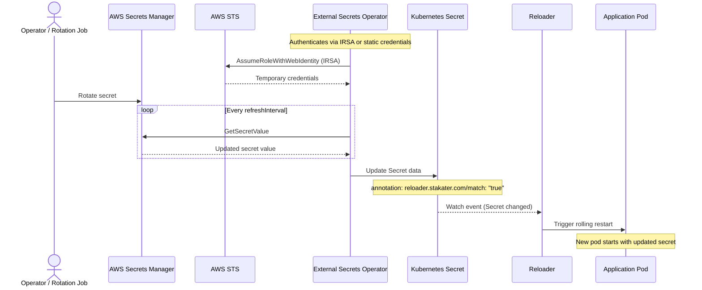

# How to Use Reloader with AWS Secrets Manager and External Secrets Operator

This guide explains how to sync secrets from AWS Secrets Manager into Kubernetes using External Secrets Operator (ESO), and use Stakater Reloader to automatically restart pods when those secrets change.

## Authentication Options

ESO supports two authentication methods for AWS Secrets Manager:

| Method | Description | Use Case |
|--------|-------------|----------|
| [**IRSA**](#option-1-irsa-iam-roles-for-service-accounts) | IAM role bound to a Kubernetes ServiceAccount via OIDC | Recommended for EKS — no static credentials |
| [**Static Credentials**](#option-2-static-credentials) | AWS access key and secret stored in a K8s Secret | Any cluster — simpler but requires credential rotation |

## How It Works



## Prerequisites

- Kubernetes cluster (v1.19+)
- Helm v3+
- AWS account with Secrets Manager access
- AWS CLI configured locally
- Stakater Reloader installed
- External Secrets Operator installed

### Install Stakater Reloader

```bash
helm repo add stakater https://stakater.github.io/stakater-charts
helm repo update
helm install reloader stakater/reloader --namespace reloader --create-namespace
```

### Install External Secrets Operator

```bash
helm repo add external-secrets https://charts.external-secrets.io
helm repo update
helm install external-secrets external-secrets/external-secrets \
  --namespace external-secrets \
  --create-namespace \
  --wait
```

Verify:

```bash
kubectl get pods -n external-secrets
```

### Create a secret in AWS Secrets Manager

```bash
aws secretsmanager create-secret \
  --name myapp/database \
  --region us-east-1 \
  --secret-string '{"username":"admin-user","password":"super-secret-password"}'
```

---

## Option 1: IRSA (IAM Roles for Service Accounts)

IRSA lets a Kubernetes ServiceAccount assume an IAM role without static credentials. It uses the EKS OIDC provider to exchange ServiceAccount tokens for temporary AWS credentials.

### IRSA: Step 1 — Enable the OIDC provider for your EKS cluster

```bash
eksctl utils associate-iam-oidc-provider \
  --cluster my-cluster \
  --region us-east-1 \
  --approve
```

If you don't have `eksctl`, use the AWS CLI:

```bash
# Get the OIDC issuer URL
OIDC_URL=$(aws eks describe-cluster \
  --name my-cluster \
  --region us-east-1 \
  --query "cluster.identity.oidc.issuer" \
  --output text)

# Create the OIDC provider
aws iam create-open-id-connect-provider \
  --url "$OIDC_URL" \
  --client-id-list sts.amazonaws.com \
  --thumbprint-list "$(openssl s_client -servername $(echo $OIDC_URL | cut -d/ -f3) \
    -showcerts -connect $(echo $OIDC_URL | cut -d/ -f3):443 </dev/null 2>/dev/null \
    | openssl x509 -fingerprint -noout | cut -d= -f2 | tr -d :)"
```

### IRSA: Step 2 — Create an IAM policy for Secrets Manager access

```bash
cat > eso-secrets-policy.json <<EOF
{
  "Version": "2012-10-17",
  "Statement": [
    {
      "Effect": "Allow",
      "Action": [
        "secretsmanager:GetSecretValue",
        "secretsmanager:DescribeSecret"
      ],
      "Resource": "arn:aws:secretsmanager:us-east-1:*:secret:myapp/*"
    }
  ]
}
EOF

aws iam create-policy \
  --policy-name ESOSecretsManagerPolicy \
  --policy-document file://eso-secrets-policy.json
```

Note the policy ARN from the output — you need it in the next step.

### IRSA: Step 3 — Create an IAM role with the OIDC trust policy

```bash
# Get your AWS account ID and OIDC issuer
ACCOUNT_ID=$(aws sts get-caller-identity --query Account --output text)
OIDC_ISSUER=$(aws eks describe-cluster \
  --name my-cluster \
  --region us-east-1 \
  --query "cluster.identity.oidc.issuer" \
  --output text | sed 's|https://||')

cat > eso-trust-policy.json <<EOF
{
  "Version": "2012-10-17",
  "Statement": [
    {
      "Effect": "Allow",
      "Principal": {
        "Federated": "arn:aws:iam::${ACCOUNT_ID}:oidc-provider/${OIDC_ISSUER}"
      },
      "Action": "sts:AssumeRoleWithWebIdentity",
      "Condition": {
        "StringEquals": {
          "${OIDC_ISSUER}:sub": "system:serviceaccount:aws-eso-test:eso-sa",
          "${OIDC_ISSUER}:aud": "sts.amazonaws.com"
        }
      }
    }
  ]
}
EOF

aws iam create-role \
  --role-name ESOSecretsManagerRole \
  --assume-role-policy-document file://eso-trust-policy.json

aws iam attach-role-policy \
  --role-name ESOSecretsManagerRole \
  --policy-arn "arn:aws:iam::${ACCOUNT_ID}:policy/ESOSecretsManagerPolicy"
```

### IRSA: Step 4 — Create namespace and annotated ServiceAccount

```bash
kubectl create namespace aws-eso-test

ROLE_ARN=$(aws iam get-role --role-name ESOSecretsManagerRole --query Role.Arn --output text)

kubectl create serviceaccount eso-sa -n aws-eso-test \
  --dry-run=client -o yaml | kubectl annotate --local -f - \
  "eks.amazonaws.com/role-arn=${ROLE_ARN}" --dry-run=client -o yaml | kubectl apply -f -
```

Or create the ServiceAccount manifest directly:

```yaml
apiVersion: v1
kind: ServiceAccount
metadata:
  name: eso-sa
  namespace: aws-eso-test
  annotations:
    eks.amazonaws.com/role-arn: "arn:aws:iam::<ACCOUNT_ID>:role/ESOSecretsManagerRole"
```

### IRSA: Step 5 — Create SecretStore

```yaml
apiVersion: external-secrets.io/v1
kind: SecretStore
metadata:
  name: aws-secret-store
  namespace: aws-eso-test
spec:
  provider:
    aws:
      service: SecretsManager
      region: us-east-1
      auth:
        jwt:
          serviceAccountRef:
            name: eso-sa
```

Apply and verify:

```bash
kubectl apply -f secret-store.yaml
kubectl get secretstore -n aws-eso-test
```

Should show `STATUS: Valid` and `READY: True`.

Now proceed to [Create ExternalSecret](#create-externalsecret).

---

## Option 2: Static Credentials

Use an AWS access key and secret stored in a Kubernetes Secret. Works with any Kubernetes cluster, not just EKS.

### Static: Step 1 — Create an IAM user and access key

```bash
aws iam create-user --user-name eso-secrets-user

cat > eso-secrets-policy.json <<EOF
{
  "Version": "2012-10-17",
  "Statement": [
    {
      "Effect": "Allow",
      "Action": [
        "secretsmanager:GetSecretValue",
        "secretsmanager:DescribeSecret"
      ],
      "Resource": "arn:aws:secretsmanager:us-east-1:*:secret:myapp/*"
    }
  ]
}
EOF

aws iam put-user-policy \
  --user-name eso-secrets-user \
  --policy-name SecretsManagerAccess \
  --policy-document file://eso-secrets-policy.json

aws iam create-access-key --user-name eso-secrets-user
```

Save the `AccessKeyId` and `SecretAccessKey` from the output.

### Static: Step 2 — Store credentials in a Kubernetes Secret

```bash
kubectl create namespace aws-eso-test

kubectl create secret generic aws-credentials -n aws-eso-test \
  --from-literal=access-key-id="<ACCESS_KEY_ID>" \
  --from-literal=secret-access-key="<SECRET_ACCESS_KEY>"
```

### Static: Step 3 — Create SecretStore

```yaml
apiVersion: external-secrets.io/v1
kind: SecretStore
metadata:
  name: aws-secret-store
  namespace: aws-eso-test
spec:
  provider:
    aws:
      service: SecretsManager
      region: us-east-1
      auth:
        secretRef:
          accessKeyIDSecretRef:
            name: aws-credentials
            key: access-key-id
          secretAccessKeySecretRef:
            name: aws-credentials
            key: secret-access-key
```

Apply and verify:

```bash
kubectl apply -f secret-store.yaml
kubectl get secretstore -n aws-eso-test
```

Should show `STATUS: Valid` and `READY: True`.

Now proceed to [Create ExternalSecret](#create-externalsecret).

---

## Common Configuration

The following steps apply to both authentication methods.

## Create ExternalSecret

```yaml
apiVersion: external-secrets.io/v1
kind: ExternalSecret
metadata:
  name: app-secrets
  namespace: aws-eso-test
spec:
  refreshInterval: 1h
  secretStoreRef:
    name: aws-secret-store
    kind: SecretStore
  target:
    name: app-secrets
    creationPolicy: Owner
    template:
      metadata:
        annotations:
          reloader.stakater.com/match: "true"
  data:
    - secretKey: username
      remoteRef:
        key: myapp/database
        property: username
    - secretKey: password
      remoteRef:
        key: myapp/database
        property: password
```

Apply and verify:

```bash
kubectl apply -f external-secret.yaml
kubectl get externalsecret -n aws-eso-test
```

Should show `STATUS: SecretSynced` and `READY: True`.

## Deploy Application

```yaml
apiVersion: apps/v1
kind: Deployment
metadata:
  name: aws-eso-test-app
  namespace: aws-eso-test
  annotations:
    reloader.stakater.com/search: "true"
spec:
  replicas: 1
  selector:
    matchLabels:
      app: aws-eso-test-app
  template:
    metadata:
      labels:
        app: aws-eso-test-app
    spec:
      containers:
        - name: app
          image: busybox:latest
          command:
            - "sh"
            - "-c"
            - |
              while true; do
                echo "Username: $APP_USERNAME"
                echo "Password: $APP_PASSWORD"
                sleep 30
              done
          env:
            - name: APP_USERNAME
              valueFrom:
                secretKeyRef:
                  name: app-secrets
                  key: username
            - name: APP_PASSWORD
              valueFrom:
                secretKeyRef:
                  name: app-secrets
                  key: password
```

Apply:

```bash
kubectl apply -f deployment.yaml
```

## Verify the Setup

```bash
# SecretStore
kubectl get secretstore -n aws-eso-test

# ExternalSecret
kubectl get externalsecret -n aws-eso-test

# Secret (created by ESO)
kubectl get secret app-secrets -n aws-eso-test

# Pod
kubectl get pods -n aws-eso-test

# Verify secret contents
kubectl get secret app-secrets -n aws-eso-test -o jsonpath='{.data.password}' | base64 -d

# Check app logs
kubectl logs -n aws-eso-test -l app=aws-eso-test-app
```

## Test Secret Rotation

### Update the secret in AWS Secrets Manager

```bash
aws secretsmanager put-secret-value \
  --secret-id myapp/database \
  --region us-east-1 \
  --secret-string '{"username":"admin-user","password":"new-rotated-password"}'
```

### Wait and verify

ESO syncs on `refreshInterval` (1h by default). To test immediately, force a sync:

```bash
kubectl annotate externalsecret app-secrets -n aws-eso-test \
  force-sync=$(date +%s) --overwrite
```

Then verify:

```bash
# Check secret was updated
kubectl get secret app-secrets -n aws-eso-test -o jsonpath='{.data.password}' | base64 -d

# Check pod was restarted (new pod name, age resets)
kubectl get pods -n aws-eso-test -l app=aws-eso-test-app

# Check app logs show new password
kubectl logs -n aws-eso-test -l app=aws-eso-test-app --tail=5
```

---

## Configuration Reference

### SecretStore — IRSA

| Field | Description |
|-------|-------------|
| `provider.aws.service` | `SecretsManager` |
| `provider.aws.region` | AWS region where the secret lives |
| `provider.aws.auth.jwt.serviceAccountRef.name` | ServiceAccount annotated with the IAM role ARN |

### SecretStore — Static Credentials

| Field | Description |
|-------|-------------|
| `provider.aws.service` | `SecretsManager` |
| `provider.aws.region` | AWS region where the secret lives |
| `provider.aws.auth.secretRef.accessKeyIDSecretRef` | K8s Secret and key containing the AWS access key ID |
| `provider.aws.auth.secretRef.secretAccessKeySecretRef` | K8s Secret and key containing the AWS secret access key |

### ExternalSecret

| Field | Description |
|-------|-------------|
| `refreshInterval` | How often ESO polls AWS for changes (e.g. `1h`, `5m`) |
| `secretStoreRef` | Reference to the SecretStore |
| `target.name` | Name of the K8s Secret to create |
| `target.template.metadata.annotations` | Annotations to add to the created Secret — add `reloader.stakater.com/match: "true"` here |
| `data[].secretKey` | Key name in the K8s Secret |
| `data[].remoteRef.key` | AWS Secrets Manager secret name or ARN |
| `data[].remoteRef.property` | Key within a JSON-formatted secret |

### Reloader Annotations

| Resource | Annotation |
|----------|------------|
| Deployment | `reloader.stakater.com/search: "true"` |
| Secret (via ExternalSecret template) | `reloader.stakater.com/match: "true"` |

---

## Comparison: IRSA vs Static Credentials

| Aspect | IRSA | Static Credentials |
|--------|------|--------------------|
| **Credentials** | Temporary STS tokens via OIDC | Static access key + secret |
| **Security** | No secrets to rotate, tokens auto-expire | Credentials must be manually rotated |
| **Cluster requirement** | EKS with OIDC provider enabled | Any Kubernetes cluster |
| **Setup complexity** | Requires IAM role + OIDC trust policy | Just an IAM user + K8s Secret |
| **Best for** | Production on EKS | Development, non-EKS clusters |

---

## Notes on `refreshInterval`

AWS Secrets Manager charges per API call. A short `refreshInterval` (e.g. `1m`) on many `ExternalSecret` resources across many namespaces can generate significant cost. For most use cases, `1h` is a good default. If you need faster propagation, consider using [AWS Secrets Manager rotation with Lambda](https://docs.aws.amazon.com/secretsmanager/latest/userguide/rotating-secrets.html) and a shorter interval only on critical secrets.
