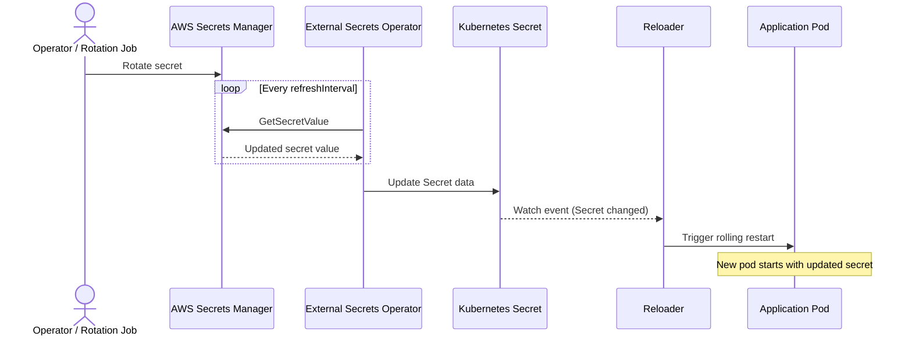

# AWS Secrets Manager Integration

This guide shows how to automatically restart Kubernetes workloads when AWS Secrets Manager secrets change, using External Secrets Operator (ESO) to sync secrets into Kubernetes and Stakater Reloader to trigger rolling restarts.

## Integration Patterns

| Pattern | How Secrets Arrive | Rotation | Reloader Compatibility | Guide |
|---------|-------------------|----------|------------------------|-------|
| **External Secrets Operator** | ESO syncs to K8s Secret | ESO refresh interval | Best fit | [ESO Guide](aws-eso.md) |

## How It Works



## Prerequisites

- Kubernetes cluster (v1.19+) — EKS recommended for IRSA, but any cluster works with static credentials
- Helm v3+
- AWS account with Secrets Manager access
- AWS CLI configured locally
- Stakater Reloader installed
- External Secrets Operator installed

## How Reloader Works

1. A secret rotates in AWS Secrets Manager (manually, via Lambda, or by automatic rotation)
1. ESO detects the change on its next refresh cycle and updates the Kubernetes Secret
1. Reloader detects the Kubernetes Secret update and triggers a rolling restart of annotated workloads

### Reloader Annotations

**On Deployment:**

```yaml
metadata:
  annotations:
    reloader.stakater.com/search: "true"
```

**On the Secret (via ExternalSecret template):**

```yaml
metadata:
  annotations:
    reloader.stakater.com/match: "true"
```

## Pattern-Specific Guides

- [External Secrets Operator Pattern](aws-eso.md) — IRSA (recommended) or static credentials
