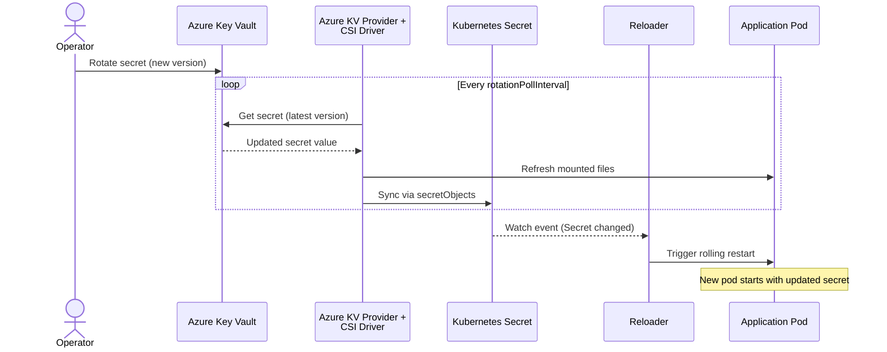

# How to Use Reloader with Azure Key Vault and CSI Driver

This guide shows how to mount secrets from Azure Key Vault into Kubernetes pods using the Azure Key Vault Provider for Secrets Store CSI Driver, then use Reloader to automatically restart pods when those secrets change.

The Azure provider syncs secrets into a Kubernetes `Secret` via `secretObjects`. Reloader watches that Kubernetes Secret and triggers a rolling restart whenever it is updated.

> **See also:** [ESO Pattern](azure-eso.md) — if you are already using External Secrets Operator, that pattern requires no CSI Driver.

---

## How It Works



---

## Prerequisites

- AKS cluster with workload identity enabled (`--enable-oidc-issuer --enable-workload-identity`)
- Azure CLI configured locally
- Helm v3+
- An existing Azure Key Vault with secrets
- Stakater Reloader installed

---

## Step 1 — Enable the CSI Driver

### Option A — AKS add-on (recommended for AKS)

Enable the Azure Key Vault provider as an AKS add-on. This installs and manages both the Secrets Store CSI Driver and the Azure provider.

On a new cluster:

```bash
az aks create \
  --resource-group <resource-group> \
  --name <cluster-name> \
  --enable-addons azure-keyvault-secrets-provider \
  --enable-secret-rotation \
  --rotation-poll-interval 2m \
  --enable-oidc-issuer \
  --enable-workload-identity
```

On an existing cluster:

```bash
az aks enable-addons \
  --resource-group <resource-group> \
  --name <cluster-name> \
  --addons azure-keyvault-secrets-provider \
  --enable-secret-rotation \
  --rotation-poll-interval 2m
```

### Option B — Helm install (non-AKS clusters)

```bash
helm repo add csi-secrets-store-provider-azure \
  https://azure.github.io/secrets-store-csi-driver-provider-azure/charts
helm repo update
helm install csi csi-secrets-store-provider-azure/csi-secrets-store-provider-azure \
  --namespace kube-system
```

Then install the Secrets Store CSI Driver separately with rotation enabled:

```bash
helm repo add secrets-store-csi-driver https://kubernetes-sigs.github.io/secrets-store-csi-driver/charts
helm install csi-secrets-store secrets-store-csi-driver/secrets-store-csi-driver \
  --namespace kube-system \
  --set syncSecret.enabled=true \
  --set enableSecretRotation=true \
  --set rotationPollInterval=2m
```

---

## Step 2 — Install Reloader

```bash
helm repo add stakater https://stakater.github.io/stakater-charts
helm repo update
helm install reloader stakater/reloader \
  --namespace reloader \
  --create-namespace
```

---

## Step 3 — Set up workload identity

Workload identity is the recommended authentication method for AKS. It uses OIDC federation to allow a Kubernetes ServiceAccount to assume an Azure managed identity, with no static credentials stored in the cluster.

### Create a user-assigned managed identity

```bash
export RESOURCE_GROUP=<resource-group>
export UAMI=reloader-csi-identity
export KEYVAULT_NAME=<key-vault-name>
export CLUSTER_NAME=<cluster-name>

az identity create \
  --name $UAMI \
  --resource-group $RESOURCE_GROUP

export USER_ASSIGNED_CLIENT_ID="$(az identity show \
  --resource-group $RESOURCE_GROUP \
  --name $UAMI \
  --query 'clientId' -o tsv)"

export IDENTITY_TENANT="$(az aks show \
  --name $CLUSTER_NAME \
  --resource-group $RESOURCE_GROUP \
  --query identity.tenantId -o tsv)"
```

### Assign Key Vault access

Grant the managed identity permission to read secrets from the Key Vault. Use Azure RBAC if the Vault has `--enable-rbac-authorization`:

```bash
export KEYVAULT_SCOPE="$(az keyvault show --name $KEYVAULT_NAME --query id -o tsv)"

az role assignment create \
  --role "Key Vault Secrets User" \
  --assignee $USER_ASSIGNED_CLIENT_ID \
  --scope $KEYVAULT_SCOPE
```

If the Vault uses access policies instead of Azure RBAC:

```bash
export IDENTITY_OBJECT_ID="$(az identity show \
  --resource-group $RESOURCE_GROUP \
  --name $UAMI \
  --query 'principalId' -o tsv)"

az keyvault set-policy \
  --name $KEYVAULT_NAME \
  --secret-permissions get \
  --object-id $IDENTITY_OBJECT_ID
```

### Create the Kubernetes ServiceAccount

```bash
export SERVICE_ACCOUNT_NAME=akv-csi-sa
export SERVICE_ACCOUNT_NAMESPACE=default

kubectl create serviceaccount $SERVICE_ACCOUNT_NAME \
  --namespace $SERVICE_ACCOUNT_NAMESPACE

kubectl annotate serviceaccount $SERVICE_ACCOUNT_NAME \
  --namespace $SERVICE_ACCOUNT_NAMESPACE \
  azure.workload.identity/client-id=$USER_ASSIGNED_CLIENT_ID
```

### Create the federated identity credential

```bash
export AKS_OIDC_ISSUER="$(az aks show \
  --resource-group $RESOURCE_GROUP \
  --name $CLUSTER_NAME \
  --query "oidcIssuerProfile.issuerUrl" -o tsv)"

az identity federated-credential create \
  --name akv-csi-federated \
  --identity-name $UAMI \
  --resource-group $RESOURCE_GROUP \
  --issuer $AKS_OIDC_ISSUER \
  --subject system:serviceaccount:${SERVICE_ACCOUNT_NAMESPACE}:${SERVICE_ACCOUNT_NAME}
```

---

## Step 4 — Create the SecretProviderClass

The `SecretProviderClass` defines which secrets to fetch from Key Vault and how to sync them into a Kubernetes Secret via `secretObjects`.

```yaml
apiVersion: secrets-store.csi.x-k8s.io/v1
kind: SecretProviderClass
metadata:
  name: akv-app-secrets
  namespace: default
spec:
  provider: azure
  parameters:
    usePodIdentity: "false"
    clientID: "<USER_ASSIGNED_CLIENT_ID>"
    keyvaultName: "<KEYVAULT_NAME>"
    tenantId: "<IDENTITY_TENANT>"
    objects: |
      array:
        - |
          objectName: db-username
          objectType: secret
          objectVersion: ""
        - |
          objectName: db-password
          objectType: secret
          objectVersion: ""
  secretObjects:
    - secretName: app-secrets
      type: Opaque
      annotations:
        reloader.stakater.com/match: "true"
      data:
        - key: username
          objectName: db-username
        - key: password
          objectName: db-password
```

Apply:

```bash
kubectl apply -f secret-provider-class.yaml
```

**Key configuration points:**

| Field | Description |
|---|---|
| `clientID` | Client ID of the user-assigned managed identity |
| `keyvaultName` | Name of the Azure Key Vault (not the full URI) |
| `tenantId` | Azure tenant ID of the Key Vault |
| `objects[].objectName` | Name of the secret, key, or certificate in Key Vault |
| `objects[].objectType` | `secret`, `key`, or `cert` |
| `objects[].objectVersion` | Specific version; leave empty to always use the latest |
| `secretObjects[].data[].objectName` | Must match `objectName` (or `objectAlias`) from the `objects` list |

---

## Step 5 — Deploy the application

The CSI volume mount is required even when your application reads secrets from environment variables. Without the mount, the Azure provider does not create the Kubernetes Secret via `secretObjects`.

```yaml
apiVersion: apps/v1
kind: Deployment
metadata:
  name: myapp
  namespace: default
  annotations:
    reloader.stakater.com/search: "true"
spec:
  replicas: 2
  selector:
    matchLabels:
      app: myapp
  template:
    metadata:
      labels:
        app: myapp
        azure.workload.identity/use: "true"
    spec:
      serviceAccountName: akv-csi-sa
      containers:
        - name: app
          image: busybox:latest
          command: ["sh", "-c", "while true; do echo \"user=$DB_USERNAME\"; sleep 30; done"]
          env:
            - name: DB_USERNAME
              valueFrom:
                secretKeyRef:
                  name: app-secrets
                  key: username
            - name: DB_PASSWORD
              valueFrom:
                secretKeyRef:
                  name: app-secrets
                  key: password
          volumeMounts:
            - name: akv-secrets
              mountPath: /mnt/secrets
              readOnly: true
      volumes:
        - name: akv-secrets
          csi:
            driver: secrets-store.csi.k8s.io
            readOnly: true
            volumeAttributes:
              secretProviderClass: akv-app-secrets
```

Apply:

```bash
kubectl apply -f deployment.yaml
```

**Important:** The pod template must have the label `azure.workload.identity/use: "true"` for the workload identity token to be projected into the pod.

---

## Step 6 — Verify the setup

```bash
# Check pod is running
kubectl get pods -n default -l app=myapp

# Confirm the Kubernetes Secret was created
kubectl get secret app-secrets -n default
kubectl get secret app-secrets -n default -o jsonpath='{.data.username}' | base64 -d

# Check the CSI mount status
kubectl get secretproviderclasspodstatuses -n default
```

---

## Step 7 — Test secret rotation

Create a new version of the secret in Azure Key Vault:

```bash
az keyvault secret set \
  --vault-name $KEYVAULT_NAME \
  --name db-password \
  --value "new-rotated-password"
```

Wait for the next rotation poll. The CSI driver fetches the new version, updates the mounted files, and syncs the new value into the Kubernetes Secret. Reloader detects the Secret update and triggers a rolling restart.

```bash
# Confirm the K8s Secret was updated
kubectl get secret app-secrets -n default -o jsonpath='{.data.password}' | base64 -d

# Confirm pods were restarted (check pod age)
kubectl get pods -n default -l app=myapp
```

---

## Reloader annotations

| Resource | Annotation | Effect |
|---|---|---|
| Deployment | `reloader.stakater.com/search: "true"` | Restart when any referenced Secret with `match: "true"` changes |
| Kubernetes Secret (via `secretObjects`) | `reloader.stakater.com/match: "true"` | Mark this Secret as eligible to trigger a restart |

---

## File-based pattern (no Kubernetes Secret)

If you want to mount secrets as files only, without creating a Kubernetes Secret, omit the `secretObjects` block and enable Reloader's CSI integration:

```yaml
reloader:
  enableCSIIntegration: true
```

Then annotate the Deployment with the `SecretProviderClass` name:

```yaml
metadata:
  annotations:
    secretproviderclass.reloader.stakater.com/reload: "akv-app-secrets"
```

In this mode, Reloader watches `SecretProviderClassPodStatus` resources for version hash changes instead of watching a Kubernetes Secret.

---

## Certificates and keys

The Azure provider supports fetching certificates and keys in addition to secrets. Set `objectType` accordingly:

| `objectType` | What is mounted |
|---|---|
| `secret` | The secret value as a plain string |
| `cert` | The certificate in PEM format (public cert only) |
| `key` | The public key in PEM format |

To fetch the full certificate chain including the private key, use `objectType: secret` on a Key Vault certificate — Key Vault stores the private key as a secret alongside the certificate.
