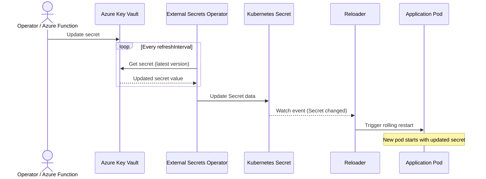

# Azure Key Vault Integration

This guide shows how to automatically restart Kubernetes workloads when Azure Key Vault secrets change, using External Secrets Operator (ESO) to sync secrets into Kubernetes and Stakater Reloader to trigger rolling restarts.

## Integration Patterns

| Pattern | How Secrets Arrive | Rotation | Reloader Compatibility | Guide |
|---------|-------------------|----------|------------------------|-------|
| **External Secrets Operator** | ESO syncs to K8s Secret | ESO refresh interval | Best fit | [ESO Guide](azure-eso.md) |
| **CSI Driver (Azure KV Provider)** | Azure provider syncs to K8s Secret via `secretObjects` | CSI rotation poll interval | Best fit | [CSI Guide](azure-csi.md) |

## How It Works



## Prerequisites

- Kubernetes cluster (v1.19+) — AKS recommended for Workload Identity, but any cluster works with a client secret
- Helm v3+
- Azure subscription with Key Vault created
- Azure CLI (`az`) configured locally
- Stakater Reloader installed
- External Secrets Operator installed

## How Reloader Works

1. A secret is updated in Azure Key Vault (manually, via Azure Functions, or by automatic rotation)
1. ESO detects the change on its next refresh cycle and updates the Kubernetes Secret
1. Reloader detects the Kubernetes Secret update and triggers a rolling restart of annotated workloads

### Reloader Annotations

**On Deployment:**

```yaml
metadata:
  annotations:
    reloader.stakater.com/search: "true"
```

**On the Secret (via ExternalSecret template):**

```yaml
metadata:
  annotations:
    reloader.stakater.com/match: "true"
```

## Pattern-Specific Guides

- [External Secrets Operator Pattern](azure-eso.md) — Workload Identity (recommended) or Client Secret
- [CSI Driver Pattern](azure-csi.md) — Azure Key Vault Provider with Workload Identity; mounts secrets as files and syncs to a Kubernetes Secret
