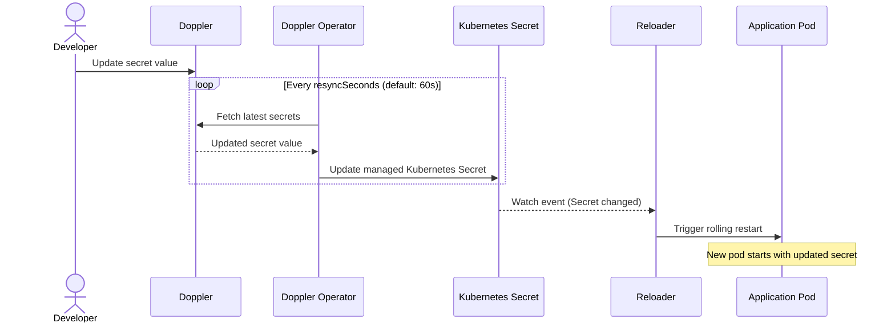

# How to Use Reloader with the Doppler Kubernetes Operator

This guide shows how to combine the Doppler Kubernetes operator with Reloader to automatically restart pods when secrets change in Doppler.

The Doppler operator syncs secrets from Doppler into Kubernetes `Secret` objects. Reloader watches those Secrets and triggers rolling restarts when their data changes. This pattern supports all Reloader-compatible workload types — including StatefulSets, Daemonsets, and Argo Rollouts — which the Doppler operator's built-in reload does not cover.

> The Doppler documentation recommends Stakater Reloader for workload types beyond Deployments.

---

## How it works



---

## Prerequisites

- Kubernetes cluster (v1.19+)
- Helm v3+
- A Doppler account with a project and config (environment) set up
- A Doppler service token for the target config
- Stakater Reloader installed

---

## Step 1 — Install the Doppler Kubernetes operator

```bash
helm repo add doppler https://helm.doppler.com
helm repo update
helm install --generate-name doppler/doppler-kubernetes-operator
```

The operator installs into the `doppler-operator-system` namespace by default.

Verify it is running:

```bash
kubectl get pods -n doppler-operator-system
```

---

## Step 2 — Install Reloader

```bash
helm repo add stakater https://stakater.github.io/stakater-charts
helm repo update
helm install reloader stakater/reloader \
  --namespace reloader \
  --create-namespace
```

---

## Step 3 — Create the Doppler service token secret

Create a Kubernetes Secret containing the Doppler service token. The operator reads this to authenticate with the Doppler API.

```bash
kubectl create secret generic doppler-token-secret \
  --namespace doppler-operator-system \
  --from-literal=serviceToken=dp.st.prd.XXXX
```

The service token must have at least read access to the target project and config. Create a dedicated service token in the Doppler dashboard under **Access** → **Service Tokens**.

---

## Step 4 — Create the DopplerSecret resource

The `DopplerSecret` CRD tells the operator which Doppler project and config to sync, and which Kubernetes Secret to write the result into.

```yaml
apiVersion: secrets.doppler.com/v1alpha1
kind: DopplerSecret
metadata:
  name: app-doppler-secret
  namespace: doppler-operator-system
spec:
  tokenSecret:
    name: doppler-token-secret
  project: my-project
  config: prd
  managedSecret:
    name: app-secrets
    namespace: default
```

Apply:

```bash
kubectl apply -f doppler-secret.yaml
```

**Key fields:**

| Field | Description |
|---|---|
| `spec.tokenSecret.name` | Name of the Kubernetes Secret holding the Doppler service token |
| `spec.project` | Doppler project name |
| `spec.config` | Doppler config (environment) name — for example, `prd`, `stg`, `dev` |
| `spec.managedSecret.name` | Name of the Kubernetes Secret the operator creates and keeps in sync |
| `spec.managedSecret.namespace` | Namespace where the managed Secret is created |
| `spec.resyncSeconds` | How often the operator polls Doppler (default: `60`) |

The operator creates the Kubernetes Secret `app-secrets` in the `default` namespace and syncs all secrets from the Doppler config into it.

Verify the Secret was created:

```bash
kubectl get secret app-secrets -n default
kubectl describe dopplersecret app-doppler-secret -n doppler-operator-system
```

---

## Step 5 — Annotate workloads for Reloader

Add the Reloader annotation to each workload that should restart when the Secret changes. Do not use the Doppler operator's built-in `secrets.doppler.com/reload: "true"` annotation on the same workload — both mechanisms would fire on the same Secret update, causing two successive restarts.

**Watch the specific Secret by name (recommended):**

```yaml
apiVersion: apps/v1
kind: Deployment
metadata:
  name: myapp
  namespace: default
  annotations:
    secret.reloader.stakater.com/reload: "app-secrets"
spec:
  replicas: 2
  selector:
    matchLabels:
      app: myapp
  template:
    metadata:
      labels:
        app: myapp
    spec:
      containers:
        - name: app
          image: myapp:latest
          env:
            - name: DB_PASSWORD
              valueFrom:
                secretKeyRef:
                  name: app-secrets
                  key: DB_PASSWORD
            - name: API_KEY
              valueFrom:
                secretKeyRef:
                  name: app-secrets
                  key: API_KEY
```

Apply:

```bash
kubectl apply -f deployment.yaml
```

---

## StatefulSets

The Doppler operator's built-in reload does not support StatefulSets. Reloader does.

```yaml
apiVersion: apps/v1
kind: StatefulSet
metadata:
  name: myapp
  namespace: default
  annotations:
    secret.reloader.stakater.com/reload: "app-secrets"
spec:
  serviceName: myapp
  replicas: 3
  selector:
    matchLabels:
      app: myapp
  template:
    metadata:
      labels:
        app: myapp
    spec:
      containers:
        - name: app
          image: myapp:latest
          env:
            - name: DB_PASSWORD
              valueFrom:
                secretKeyRef:
                  name: app-secrets
                  key: DB_PASSWORD
```

---

## Argo Rollouts

The Doppler operator's built-in reload does not support Argo Rollouts. Reloader does, with one extra Helm value.

Enable Argo Rollouts support in Reloader:

```yaml
reloader:
  isArgoRollouts: true
```

Then annotate the Rollout:

```yaml
apiVersion: argoproj.io/v1alpha1
kind: Rollout
metadata:
  name: myapp
  namespace: default
  annotations:
    secret.reloader.stakater.com/reload: "app-secrets"
spec:
  replicas: 3
  selector:
    matchLabels:
      app: myapp
  template:
    metadata:
      labels:
        app: myapp
    spec:
      containers:
        - name: app
          image: myapp:latest
          env:
            - name: API_KEY
              valueFrom:
                secretKeyRef:
                  name: app-secrets
                  key: API_KEY
```

---

## Step 6 — Test secret rotation

Update a secret value in the Doppler dashboard, then wait for the next sync interval (default: 60 seconds).

Confirm the Kubernetes Secret was updated:

```bash
kubectl get secret app-secrets -n default -o jsonpath='{.data.DB_PASSWORD}' | base64 -d
```

Confirm pods were restarted:

```bash
kubectl rollout status deployment/myapp -n default
kubectl get pods -n default -l app=myapp
```

Check Reloader logs to confirm the reload was triggered:

```bash
kubectl logs -n reloader -l app=reloader-reloader --tail=20
```

Expected output:

```text
Changes detected in 'app-secrets' of type 'Secret' in namespace 'default'
Updated 'myapp' of type 'Deployment' in namespace 'default'
```

---

## Reloader annotations reference

| Annotation | Placed on | Effect |
|---|---|---|
| `secret.reloader.stakater.com/reload: "app-secrets"` | Any workload | Restart when the named Secret changes |
| `reloader.stakater.com/auto: "true"` | Any workload | Restart when any Secret or ConfigMap referenced in the pod spec changes |
| `reloader.stakater.com/search: "true"` | Workload | Restart when any Secret annotated with `reloader.stakater.com/match: "true"` changes |

---

## Faster sync with `resyncSeconds`

To reduce the delay between a Doppler change and a pod restart, lower `resyncSeconds`:

```yaml
spec:
  resyncSeconds: 15
```

The Doppler documentation recommends the default of 60 seconds for most use cases. Lower values increase API request volume against the Doppler API.

---

## Cooldown between reloads

To prevent rapid successive restarts when multiple secrets are updated at once:

```yaml
metadata:
  annotations:
    secret.reloader.stakater.com/reload: "app-secrets"
    deployment.reloader.stakater.com/pause-period: "2m"
```

During the pause period, additional Secret changes do not trigger another restart.
