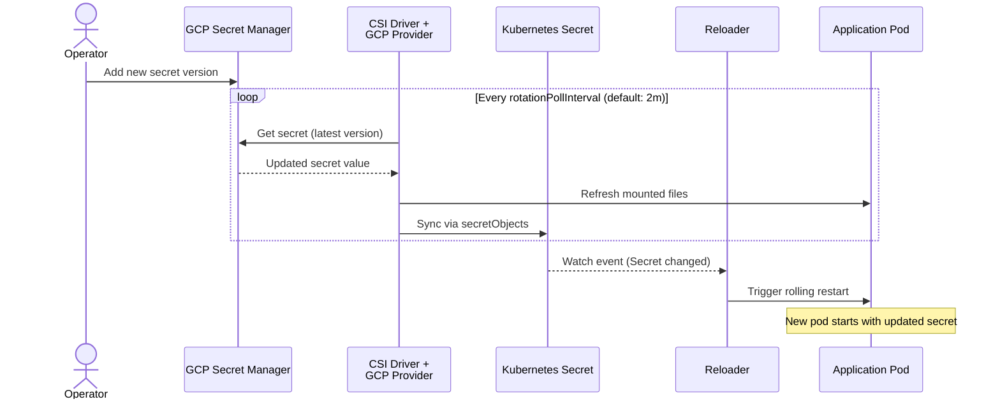

# How to Use Reloader with GCP Secret Manager and CSI Driver

This guide shows how to mount secrets from GCP Secret Manager into Kubernetes pods using the Secrets Store CSI Driver with the GCP Secret Manager provider, then use Reloader to automatically restart pods when those secrets change.

The GCP provider syncs secrets into a Kubernetes `Secret` via `secretObjects`. Reloader watches that Kubernetes Secret and triggers a rolling restart whenever it is updated.

> **See also:** [ESO Pattern](gcp-eso.md) — if you are already using External Secrets Operator, that pattern is simpler and does not require the CSI Driver.

---

## Provider options on GCP

There are two CSI paths for GCP Secret Manager. They are not interchangeable:

| | Open-source provider | GKE managed add-on |
|---|---|---|
| `spec.provider` value | `gcp` | `gke` |
| Install method | `kubectl apply` from GitHub | `gcloud` / Cloud Console |
| `secretObjects` sync to Kubernetes Secret | ✅ | ❌ |
| Secret rotation polling | ✅ Alpha | ✅ GKE 1.32.2+ |
| Officially supported by Google | ❌ Community project | ✅ |

**This guide uses the open-source provider** (`spec.provider: gcp`), because it is the only path that supports `secretObjects` — which is required to create the Kubernetes Secret that Reloader watches. The GKE managed add-on mounts secrets as files only and cannot be used with this pattern.

---

## How it works



---

## Prerequisites

- GKE cluster with Workload Identity enabled (`--workload-pool=<project-id>.svc.id.goog`)
- `gcloud` CLI configured locally
- Helm v3+
- GCP project with Secret Manager API enabled
- Stakater Reloader installed

---

## Step 1 — Install the Secrets Store CSI Driver

Install the CSI Driver with secret sync and rotation enabled:

```bash
helm repo add secrets-store-csi-driver \
  https://kubernetes-sigs.github.io/secrets-store-csi-driver/charts
helm repo update
helm install csi-secrets-store secrets-store-csi-driver/secrets-store-csi-driver \
  --namespace kube-system \
  --set syncSecret.enabled=true \
  --set enableSecretRotation=true \
  --set rotationPollInterval=2m
```

`syncSecret.enabled=true` is required — without it, `secretObjects` does not create a Kubernetes Secret and Reloader has nothing to watch.

---

## Step 2 — Install the GCP Secret Manager provider

The GCP provider does not have a public Helm repository. Install it directly from the official GitHub source:

```bash
kubectl apply -f https://raw.githubusercontent.com/GoogleCloudPlatform/secrets-store-csi-driver-provider-gcp/main/deploy/provider-gcp-plugin.yaml
```

This deploys the provider as a DaemonSet in the `kube-system` namespace.

Verify it is running:

```bash
kubectl get pods -n kube-system -l app=csi-secrets-store-provider-gcp
```

---

## Step 3 — Install Reloader

```bash
helm repo add stakater https://stakater.github.io/stakater-charts
helm repo update
helm install reloader stakater/reloader \
  --namespace reloader \
  --create-namespace
```

---

## Step 4 — Grant Workload Identity access

Workload Identity allows a Kubernetes ServiceAccount to access GCP APIs without a service account key file. This is the recommended authentication method on GKE.

### Enable Secret Manager API

```bash
gcloud services enable secretmanager.googleapis.com \
  --project=<PROJECT_ID>
```

### Grant the Kubernetes ServiceAccount access to the secret

The preferred approach binds IAM permissions directly to the Kubernetes identity — no GCP Service Account is required:

```bash
export PROJECT_ID=<your-project-id>
export PROJECT_NUMBER=$(gcloud projects describe $PROJECT_ID --format="value(projectNumber)")
export NAMESPACE=default
export KSA_NAME=app-sa
export SECRET_NAME=db-password

gcloud secrets add-iam-policy-binding $SECRET_NAME \
  --project=$PROJECT_ID \
  --role=roles/secretmanager.secretAccessor \
  --member="principal://iam.googleapis.com/projects/${PROJECT_NUMBER}/locations/global/workloadIdentityPools/${PROJECT_ID}.svc.id.goog/subject/ns/${NAMESPACE}/sa/${KSA_NAME}"
```

### Create the Kubernetes ServiceAccount

```bash
kubectl create serviceaccount $KSA_NAME --namespace $NAMESPACE
```

No annotation is needed on the ServiceAccount when using direct IAM binding to the Kubernetes identity.

---

## Step 5 — Create a secret in GCP Secret Manager

```bash
echo -n "initial-password" | \
  gcloud secrets create db-password \
    --data-file=- \
    --project=$PROJECT_ID
```

Note the full resource name — you will need it in the `SecretProviderClass`:

```bash
gcloud secrets describe db-password --project=$PROJECT_ID --format="value(name)"
```

Output format: `projects/<PROJECT_NUMBER>/secrets/db-password`

---

## Step 6 — Create the SecretProviderClass

```yaml
apiVersion: secrets-store.csi.x-k8s.io/v1
kind: SecretProviderClass
metadata:
  name: gcp-app-secrets
  namespace: default
spec:
  provider: gcp
  parameters:
    secrets: |
      - resourceName: "projects/<PROJECT_ID>/secrets/db-password/versions/latest"
        path: "db-password"
      - resourceName: "projects/<PROJECT_ID>/secrets/api-key/versions/latest"
        path: "api-key"
  secretObjects:
    - secretName: app-secrets
      type: Opaque
      annotations:
        reloader.stakater.com/match: "true"
      data:
        - objectName: db-password
          key: db-password
        - objectName: api-key
          key: api-key
```

Apply:

```bash
kubectl apply -f secret-provider-class.yaml
```

**Key configuration points:**

| Field | Description |
|---|---|
| `spec.provider` | Must be `gcp` (not `gke`, not `google`) |
| `parameters.secrets` | YAML list as a string; each entry needs `resourceName` and `path` |
| `resourceName` | Full GCP resource path: `projects/<id>/secrets/<name>/versions/<version-or-latest>` |
| `path` | Filename in the mounted volume; must match `objectName` in `secretObjects` |
| `secretObjects[].data[].objectName` | Must match the `path` value from the `parameters.secrets` entry |

---

## Step 7 — Deploy the application

The CSI volume mount is required even when your application reads secrets as environment variables. Without it, the GCP provider does not create the Kubernetes Secret via `secretObjects`.

```yaml
apiVersion: apps/v1
kind: Deployment
metadata:
  name: myapp
  namespace: default
  annotations:
    reloader.stakater.com/search: "true"
spec:
  replicas: 2
  selector:
    matchLabels:
      app: myapp
  template:
    metadata:
      labels:
        app: myapp
    spec:
      serviceAccountName: app-sa
      containers:
        - name: app
          image: busybox:latest
          command: ["sh", "-c", "while true; do echo \"password=$DB_PASSWORD\"; sleep 30; done"]
          env:
            - name: DB_PASSWORD
              valueFrom:
                secretKeyRef:
                  name: app-secrets
                  key: db-password
            - name: API_KEY
              valueFrom:
                secretKeyRef:
                  name: app-secrets
                  key: api-key
          volumeMounts:
            - name: gcp-secrets
              mountPath: /mnt/secrets
              readOnly: true
      volumes:
        - name: gcp-secrets
          csi:
            driver: secrets-store.csi.k8s.io
            readOnly: true
            volumeAttributes:
              secretProviderClass: gcp-app-secrets
```

Apply:

```bash
kubectl apply -f deployment.yaml
```

---

## Step 8 — Verify the setup

```bash
# Check the pod is running
kubectl get pods -n default -l app=myapp

# Confirm the Kubernetes Secret was created
kubectl get secret app-secrets -n default
kubectl get secret app-secrets -n default -o jsonpath='{.data.db-password}' | base64 -d

# Check the CSI mount status
kubectl get secretproviderclasspodstatuses -n default
```

---

## Step 9 — Test secret rotation

Add a new version to the secret in GCP Secret Manager:

```bash
echo -n "rotated-password" | \
  gcloud secrets versions add db-password \
    --data-file=- \
    --project=$PROJECT_ID
```

Wait for the next rotation poll (default: 2 minutes). The CSI driver fetches the new version, updates the mounted files, and syncs the new value into the Kubernetes Secret. Reloader detects the Secret update and triggers a rolling restart.

```bash
# Confirm the Kubernetes Secret was updated
kubectl get secret app-secrets -n default -o jsonpath='{.data.db-password}' | base64 -d

# Confirm pods were restarted
kubectl get pods -n default -l app=myapp
```

---

## Reloader annotations

| Resource | Annotation | Effect |
|---|---|---|
| Deployment | `reloader.stakater.com/search: "true"` | Restart when any referenced Secret with `match: "true"` changes |
| Kubernetes Secret (via `secretObjects`) | `reloader.stakater.com/match: "true"` | Mark this Secret as eligible to trigger a restart |

---

## File-based pattern (no Kubernetes Secret)

If you want to mount secrets as files only, without creating a Kubernetes Secret, omit the `secretObjects` block and enable Reloader's CSI integration:

```yaml
reloader:
  enableCSIIntegration: true
```

Then annotate the Deployment with the `SecretProviderClass` name:

```yaml
metadata:
  annotations:
    secretproviderclass.reloader.stakater.com/reload: "gcp-app-secrets"
```

In this mode, Reloader watches `SecretProviderClassPodStatus` resources for version hash changes instead of watching a Kubernetes Secret.

---

## ESO vs CSI Driver for GCP

| | ESO | CSI Driver (provider-gcp) |
|---|---|---|
| Kubernetes Secret created | ✅ Always | ✅ With `secretObjects` |
| Requires pod volume mount | ❌ | ✅ Required even for env var usage |
| Secret rotation | ESO refresh interval | CSI rotation poll interval |
| Officially supported | ESO is CNCF-graduated | Community project (not Google-supported) |
| Complexity | Lower | Higher |

For most GCP users, the [ESO pattern](gcp-eso.md) is simpler and better supported. Use the CSI Driver pattern when you need file-based secret mounting or when your organisation already uses the Secrets Store CSI Driver across multiple cloud providers.
