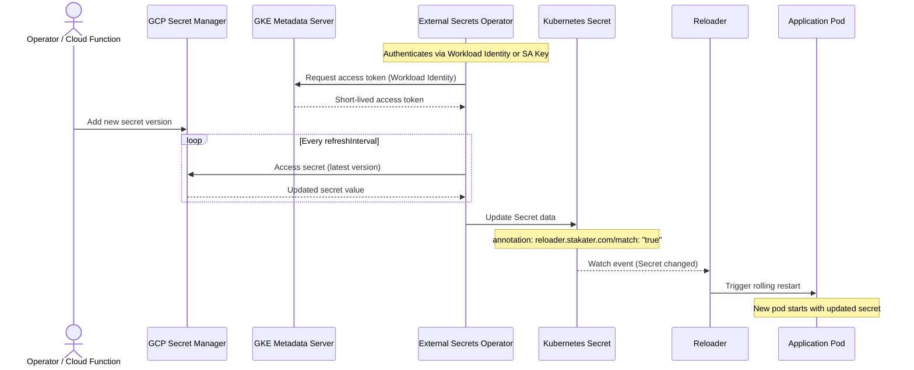

# How to Use Reloader with GCP Secret Manager and External Secrets Operator

This guide explains how to sync secrets from GCP Secret Manager into Kubernetes using External Secrets Operator (ESO), and use Stakater Reloader to automatically restart pods when those secrets change.

## Authentication Options

ESO supports two authentication methods for GCP Secret Manager:

| Method | Description | Use Case |
|--------|-------------|----------|
| [**Workload Identity**](#option-1-workload-identity) | GCP IAM bound to a Kubernetes ServiceAccount via GKE OIDC | Recommended for GKE — no static credentials |
| [**Service Account Key**](#option-2-service-account-key) | GCP service account JSON key stored in a K8s Secret | Any cluster — simpler but requires key rotation |

## How It Works



## Prerequisites

- Kubernetes cluster (v1.19+)
- Helm v3+
- GCP project with Secret Manager API enabled
- `gcloud` CLI configured locally
- Stakater Reloader installed
- External Secrets Operator installed

### Enable the Secret Manager API

```bash
gcloud services enable secretmanager.googleapis.com --project=my-project
```

### Install Stakater Reloader

```bash
helm repo add stakater https://stakater.github.io/stakater-charts
helm repo update
helm install reloader stakater/reloader --namespace reloader --create-namespace
```

### Install External Secrets Operator

```bash
helm repo add external-secrets https://charts.external-secrets.io
helm repo update
helm install external-secrets external-secrets/external-secrets \
  --namespace external-secrets \
  --create-namespace \
  --wait
```

Verify:

```bash
kubectl get pods -n external-secrets
```

### Create a secret in GCP Secret Manager

```bash
# Create the secret
gcloud secrets create myapp-database \
  --project=my-project \
  --replication-policy=automatic

# Add a secret version (JSON value)
echo -n '{"username":"admin-user","password":"super-secret-password"}' | \
  gcloud secrets versions add myapp-database \
    --project=my-project \
    --data-file=-
```

---

## Option 1: Workload Identity

Workload Identity lets a Kubernetes ServiceAccount impersonate a GCP service account without any static key. It is the recommended approach for GKE clusters.

### Workload Identity: Step 1 — Enable Workload Identity on your GKE cluster

```bash
gcloud container clusters update my-cluster \
  --workload-pool=my-project.svc.id.goog \
  --region=us-central1
```

For new clusters:

```bash
gcloud container clusters create my-cluster \
  --workload-pool=my-project.svc.id.goog \
  --region=us-central1
```

### Workload Identity: Step 2 — Create a GCP service account

```bash
gcloud iam service-accounts create eso-sa \
  --project=my-project \
  --display-name="ESO Secret Manager SA"
```

### Workload Identity: Step 3 — Grant Secret Manager access to the GCP service account

```bash
gcloud projects add-iam-policy-binding my-project \
  --member="serviceAccount:eso-sa@my-project.iam.gserviceaccount.com" \
  --role="roles/secretmanager.secretAccessor"
```

To restrict access to specific secrets rather than all secrets in the project:

```bash
gcloud secrets add-iam-policy-binding myapp-database \
  --project=my-project \
  --member="serviceAccount:eso-sa@my-project.iam.gserviceaccount.com" \
  --role="roles/secretmanager.secretAccessor"
```

### Workload Identity: Step 4 — Create namespace and Kubernetes ServiceAccount

```bash
kubectl create namespace gcp-eso-test

kubectl create serviceaccount eso-ksa -n gcp-eso-test
```

### Workload Identity: Step 5 — Bind the Kubernetes ServiceAccount to the GCP service account

```bash
# Allow the K8s SA to impersonate the GCP SA
gcloud iam service-accounts add-iam-policy-binding \
  eso-sa@my-project.iam.gserviceaccount.com \
  --project=my-project \
  --role=roles/iam.workloadIdentityUser \
  --member="serviceAccount:my-project.svc.id.goog[gcp-eso-test/eso-ksa]"

# Annotate the K8s ServiceAccount
kubectl annotate serviceaccount eso-ksa -n gcp-eso-test \
  iam.gke.io/gcp-service-account=eso-sa@my-project.iam.gserviceaccount.com
```

### Workload Identity: Step 6 — Create SecretStore

```yaml
apiVersion: external-secrets.io/v1
kind: SecretStore
metadata:
  name: gcp-secret-store
  namespace: gcp-eso-test
spec:
  provider:
    gcpsm:
      projectID: my-project
      auth:
        workloadIdentity:
          clusterLocation: us-central1
          clusterName: my-cluster
          serviceAccountRef:
            name: eso-ksa
```

Apply and verify:

```bash
kubectl apply -f secret-store.yaml
kubectl get secretstore -n gcp-eso-test
```

Should show `STATUS: Valid` and `READY: True`.

Now proceed to [Create ExternalSecret](#create-externalsecret).

---

## Option 2: Service Account Key

Use a GCP service account JSON key stored in a Kubernetes Secret. Works with any Kubernetes cluster, not just GKE.

### Key: Step 1 — Create a GCP service account and key

```bash
gcloud iam service-accounts create eso-sa \
  --project=my-project \
  --display-name="ESO Secret Manager SA"

gcloud projects add-iam-policy-binding my-project \
  --member="serviceAccount:eso-sa@my-project.iam.gserviceaccount.com" \
  --role="roles/secretmanager.secretAccessor"

gcloud iam service-accounts keys create eso-sa-key.json \
  --iam-account=eso-sa@my-project.iam.gserviceaccount.com \
  --project=my-project
```

**Important:** Store `eso-sa-key.json` securely. Treat it as a long-lived credential that must be rotated if compromised.

### Key: Step 2 — Store the key in a Kubernetes Secret

```bash
kubectl create namespace gcp-eso-test

kubectl create secret generic gcp-credentials -n gcp-eso-test \
  --from-file=key.json=eso-sa-key.json
```

### Key: Step 3 — Create SecretStore

```yaml
apiVersion: external-secrets.io/v1
kind: SecretStore
metadata:
  name: gcp-secret-store
  namespace: gcp-eso-test
spec:
  provider:
    gcpsm:
      projectID: my-project
      auth:
        secretRef:
          secretAccessKeySecretRef:
            name: gcp-credentials
            key: key.json
```

Apply and verify:

```bash
kubectl apply -f secret-store.yaml
kubectl get secretstore -n gcp-eso-test
```

Should show `STATUS: Valid` and `READY: True`.

Now proceed to [Create ExternalSecret](#create-externalsecret).

---

## Common Configuration

The following steps apply to both authentication methods.

## Create ExternalSecret

GCP Secret Manager stores secrets as opaque byte strings (not structured key-value pairs). A single secret version holds the entire value.

**If your secret is a JSON object** (as created above), use `dataFrom` to extract individual keys:

```yaml
apiVersion: external-secrets.io/v1
kind: ExternalSecret
metadata:
  name: app-secrets
  namespace: gcp-eso-test
spec:
  refreshInterval: 1h
  secretStoreRef:
    name: gcp-secret-store
    kind: SecretStore
  target:
    name: app-secrets
    creationPolicy: Owner
    template:
      metadata:
        annotations:
          reloader.stakater.com/match: "true"
  dataFrom:
    - extract:
        key: myapp-database
```

**If your secret is a plain string**, use `data` with a single key:

```yaml
spec:
  ...
  data:
    - secretKey: password
      remoteRef:
        key: myapp-database
```

Apply and verify:

```bash
kubectl apply -f external-secret.yaml
kubectl get externalsecret -n gcp-eso-test
```

Should show `STATUS: SecretSynced` and `READY: True`.

## Deploy Application

```yaml
apiVersion: apps/v1
kind: Deployment
metadata:
  name: gcp-eso-test-app
  namespace: gcp-eso-test
  annotations:
    reloader.stakater.com/search: "true"
spec:
  replicas: 1
  selector:
    matchLabels:
      app: gcp-eso-test-app
  template:
    metadata:
      labels:
        app: gcp-eso-test-app
    spec:
      containers:
        - name: app
          image: busybox:latest
          command:
            - "sh"
            - "-c"
            - |
              while true; do
                echo "Username: $APP_USERNAME"
                echo "Password: $APP_PASSWORD"
                sleep 30
              done
          env:
            - name: APP_USERNAME
              valueFrom:
                secretKeyRef:
                  name: app-secrets
                  key: username
            - name: APP_PASSWORD
              valueFrom:
                secretKeyRef:
                  name: app-secrets
                  key: password
```

Apply:

```bash
kubectl apply -f deployment.yaml
```

## Verify the Setup

```bash
# SecretStore
kubectl get secretstore -n gcp-eso-test

# ExternalSecret
kubectl get externalsecret -n gcp-eso-test

# Secret (created by ESO)
kubectl get secret app-secrets -n gcp-eso-test

# Pod
kubectl get pods -n gcp-eso-test

# Verify secret contents
kubectl get secret app-secrets -n gcp-eso-test -o jsonpath='{.data.password}' | base64 -d

# Check app logs
kubectl logs -n gcp-eso-test -l app=gcp-eso-test-app
```

## Test Secret Rotation

### Add a new version in GCP Secret Manager

```bash
echo -n '{"username":"admin-user","password":"new-rotated-password"}' | \
  gcloud secrets versions add myapp-database \
    --project=my-project \
    --data-file=-
```

GCP Secret Manager keeps all previous versions. ESO always reads the **latest** version unless you pin a specific version in the `ExternalSecret`.

### Wait and verify

To force an immediate ESO sync without waiting for `refreshInterval`:

```bash
kubectl annotate externalsecret app-secrets -n gcp-eso-test \
  force-sync=$(date +%s) --overwrite
```

Then verify:

```bash
# Check secret was updated
kubectl get secret app-secrets -n gcp-eso-test -o jsonpath='{.data.password}' | base64 -d

# Check pod was restarted
kubectl get pods -n gcp-eso-test -l app=gcp-eso-test-app

# Check app logs show new password
kubectl logs -n gcp-eso-test -l app=gcp-eso-test-app --tail=5
```

---

## Configuration Reference

### SecretStore — Workload Identity

| Field | Description |
|-------|-------------|
| `provider.gcpsm.projectID` | GCP project ID |
| `provider.gcpsm.auth.workloadIdentity.clusterLocation` | GKE cluster region or zone |
| `provider.gcpsm.auth.workloadIdentity.clusterName` | GKE cluster name |
| `provider.gcpsm.auth.workloadIdentity.serviceAccountRef.name` | Kubernetes ServiceAccount annotated with the GCP service account |

### SecretStore — Service Account Key

| Field | Description |
|-------|-------------|
| `provider.gcpsm.projectID` | GCP project ID |
| `provider.gcpsm.auth.secretRef.secretAccessKeySecretRef.name` | K8s Secret containing the JSON key |
| `provider.gcpsm.auth.secretRef.secretAccessKeySecretRef.key` | Key within the Secret holding the JSON key content |

### ExternalSecret

| Field | Description |
|-------|-------------|
| `refreshInterval` | How often ESO polls GCP for changes (e.g. `1h`, `5m`) |
| `secretStoreRef` | Reference to the SecretStore |
| `target.name` | Name of the K8s Secret to create |
| `target.template.metadata.annotations` | Annotations to add to the created Secret |
| `dataFrom[].extract.key` | GCP secret name — extracts all keys from a JSON-structured secret |
| `data[].remoteRef.key` | GCP secret name for plain string secrets |

### Reloader Annotations

| Resource | Annotation |
|----------|------------|
| Deployment | `reloader.stakater.com/search: "true"` |
| Secret (via ExternalSecret template) | `reloader.stakater.com/match: "true"` |

---

## Comparison: Workload Identity vs Service Account Key

| Aspect | Workload Identity | Service Account Key |
|--------|-------------------|---------------------|
| **Credentials** | No static key — short-lived tokens | Long-lived JSON key file |
| **Security** | No credentials to leak or rotate | Key must be rotated if compromised |
| **Cluster requirement** | GKE with Workload Identity enabled | Any Kubernetes cluster |
| **Setup complexity** | Requires IAM binding + K8s SA annotation | Just a service account key + K8s Secret |
| **Best for** | Production on GKE | Development, non-GKE clusters |
