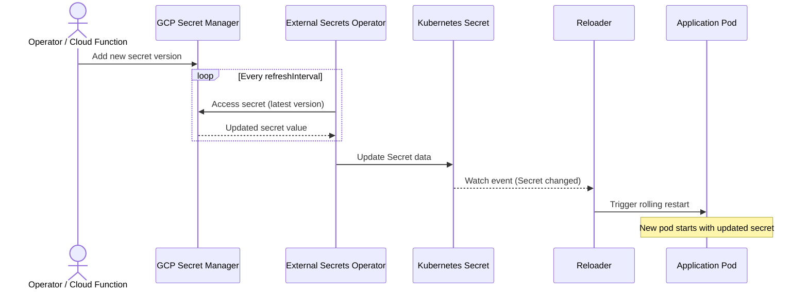

# GCP Secret Manager Integration

This guide shows how to automatically restart Kubernetes workloads when GCP Secret Manager secrets change, using External Secrets Operator (ESO) to sync secrets into Kubernetes and Stakater Reloader to trigger rolling restarts.

## Integration Patterns

| Pattern | How Secrets Arrive | Rotation | Reloader Compatibility | Guide |
|---------|-------------------|----------|------------------------|-------|
| **External Secrets Operator** | ESO syncs to K8s Secret | ESO refresh interval | Best fit | [ESO Guide](gcp-eso.md) |

## How It Works



## Prerequisites

- Kubernetes cluster (v1.19+) — GKE recommended for Workload Identity, but any cluster works with a service account key
- Helm v3+
- GCP project with Secret Manager API enabled
- `gcloud` CLI configured locally
- Stakater Reloader installed
- External Secrets Operator installed

## How Reloader Works

1. A secret version is added in GCP Secret Manager (manually, via Cloud Functions, or by a rotation job)
1. ESO detects the change on its next refresh cycle and updates the Kubernetes Secret
1. Reloader detects the Kubernetes Secret update and triggers a rolling restart of annotated workloads

### Reloader Annotations

**On Deployment:**

```yaml
metadata:
  annotations:
    reloader.stakater.com/search: "true"
```

**On the Secret (via ExternalSecret template):**

```yaml
metadata:
  annotations:
    reloader.stakater.com/match: "true"
```

## Pattern-Specific Guides

- [External Secrets Operator Pattern](gcp-eso.md) — Workload Identity (recommended) or Service Account Key
