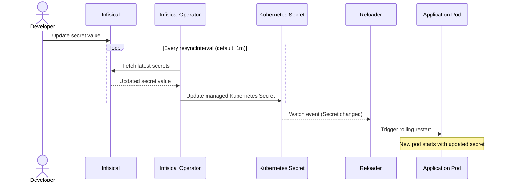

# How to Use Reloader with the Infisical Kubernetes Operator

This guide shows how to combine the Infisical Kubernetes operator with Reloader to automatically restart pods when secrets change in Infisical.

The Infisical operator syncs secrets from Infisical into Kubernetes `Secret` objects. Reloader watches those Secrets and triggers rolling restarts when their data changes. This pattern supports all Reloader-compatible workload types including Argo Rollouts, which the Infisical operator's built-in reload does not cover.

---

## How it works



---

## Prerequisites

- Kubernetes cluster (v1.19+)
- Helm v3+
- An Infisical account (cloud at `app.infisical.com` or self-hosted)
- Infisical project with secrets configured
- Stakater Reloader installed

---

## Step 1 — Install the Infisical Kubernetes operator

```bash
helm repo add infisical-helm-charts \
  'https://dl.cloudsmith.io/public/infisical/helm-charts/helm/charts/'
helm repo update
helm install infisical-operator infisical-helm-charts/secrets-operator \
  --namespace infisical-operator \
  --create-namespace
```

Verify the operator is running:

```bash
kubectl get pods -n infisical-operator
```

---

## Step 2 — Install Reloader

```bash
helm repo add stakater https://stakater.github.io/stakater-charts
helm repo update
helm install reloader stakater/reloader \
  --namespace reloader \
  --create-namespace
```

---

## Step 3 — Create a machine identity for the operator

The Infisical operator authenticates to Infisical using a machine identity. Kubernetes auth is the recommended method for clusters — it uses the operator's ServiceAccount token with no static credentials stored in the cluster.

In the Infisical dashboard:

1. Navigate to **Access Control** → **Machine Identities**
1. Create a new identity and note the **Identity ID**
1. Add the identity to your project with at least **Viewer** access
1. Under the identity's auth methods, enable **Kubernetes Auth** and set the allowed service account name and namespace

---

## Step 4 — Create the InfisicalSecret resource

The `InfisicalSecret` CRD tells the operator which secrets to sync and where to write them.

```yaml
apiVersion: secrets.infisical.com/v1alpha1
kind: InfisicalSecret
metadata:
  name: app-infisical-secret
  namespace: default
spec:
  hostAPI: https://app.infisical.com/api
  syncConfig:
    resyncInterval: 1m
  authentication:
    kubernetesAuth:
      identityId: <your-machine-identity-id>
      serviceAccountRef:
        name: infisical-operator
        namespace: infisical-operator
  managedKubeSecretReferences:
    - secretName: app-secrets
      secretNamespace: default
      creationPolicy: "Owner"
      template:
        includeAllSecrets: true
```

Apply:

```bash
kubectl apply -f infisical-secret.yaml
```

**Key fields:**

| Field | Description |
|---|---|
| `hostAPI` | Infisical API endpoint. Use `https://app.infisical.com/api` for cloud; replace with your self-hosted URL |
| `resyncInterval` | How often the operator polls Infisical for changes. Default is `1m` |
| `identityId` | The machine identity ID from your Infisical dashboard |
| `secretName` | Name of the Kubernetes Secret the operator creates |
| `creationPolicy` | `Owner` (operator manages the Secret lifecycle) or `Orphan` (Secret persists after `InfisicalSecret` is deleted) |
| `includeAllSecrets` | Sync all secrets from the project to this Kubernetes Secret |

The operator creates the Kubernetes Secret `app-secrets` in the `default` namespace and keeps it in sync.

Verify the Secret was created:

```bash
kubectl get secret app-secrets -n default
kubectl describe infisicalsecret app-infisical-secret -n default
```

---

## Step 5 — Annotate workloads for Reloader

Add the Reloader annotation to each workload that should restart when the Secret changes.

**Recommended pattern — watch the specific Secret by name:**

```yaml
apiVersion: apps/v1
kind: Deployment
metadata:
  name: myapp
  namespace: default
  annotations:
    secret.reloader.stakater.com/reload: "app-secrets"
spec:
  replicas: 2
  selector:
    matchLabels:
      app: myapp
  template:
    metadata:
      labels:
        app: myapp
    spec:
      containers:
        - name: app
          image: myapp:latest
          env:
            - name: DB_PASSWORD
              valueFrom:
                secretKeyRef:
                  name: app-secrets
                  key: DB_PASSWORD
            - name: API_KEY
              valueFrom:
                secretKeyRef:
                  name: app-secrets
                  key: API_KEY
```

Apply:

```bash
kubectl apply -f deployment.yaml
```

---

## Argo Rollouts

For Argo Rollouts, the annotation is the same. The Infisical operator's built-in `secrets.infisical.com/auto-reload` does not support Argo Rollouts; Reloader does.

Enable Argo Rollouts support in Reloader's Helm values:

```yaml
reloader:
  isArgoRollouts: true
```

Then annotate the Rollout:

```yaml
apiVersion: argoproj.io/v1alpha1
kind: Rollout
metadata:
  name: myapp
  namespace: default
  annotations:
    secret.reloader.stakater.com/reload: "app-secrets"
spec:
  replicas: 3
  selector:
    matchLabels:
      app: myapp
  template:
    metadata:
      labels:
        app: myapp
    spec:
      containers:
        - name: app
          image: myapp:latest
          env:
            - name: DB_PASSWORD
              valueFrom:
                secretKeyRef:
                  name: app-secrets
                  key: DB_PASSWORD
```

---

## Step 6 — Test the rotation

Update a secret value in the Infisical dashboard, then wait for the next sync interval (default: 1 minute).

Confirm the Kubernetes Secret was updated:

```bash
kubectl get secret app-secrets -n default -o jsonpath='{.data.DB_PASSWORD}' | base64 -d
```

Confirm pods were restarted:

```bash
kubectl rollout status deployment/myapp -n default
kubectl get pods -n default -l app=myapp
```

Check Reloader logs to confirm the reload was triggered:

```bash
kubectl logs -n reloader -l app=reloader-reloader --tail=20
```

Expected log output:

```text
Changes detected in 'app-secrets' of type 'Secret' in namespace 'default'
Updated 'myapp' of type 'Deployment' in namespace 'default'
```

---

## Reloader annotations reference

| Annotation | Placed on | Effect |
|---|---|---|
| `secret.reloader.stakater.com/reload: "app-secrets"` | Deployment / StatefulSet / Daemonset / Rollout | Restart when the named Secret changes |
| `reloader.stakater.com/auto: "true"` | Deployment / StatefulSet / Daemonset / Rollout | Restart when any Secret or ConfigMap referenced in the pod spec changes |
| `reloader.stakater.com/search: "true"` | Deployment | Restart when any Secret annotated with `reloader.stakater.com/match: "true"` changes |

---

## Disable Infisical's built-in auto-reload

If you are using Reloader, do not also set `secrets.infisical.com/auto-reload: "true"` on the same workload. Both mechanisms would fire on the same Secret update, causing two successive restarts. Use one or the other.

---

## Using ConfigMaps

The Infisical operator supports syncing non-sensitive values into Kubernetes ConfigMaps via the same `managedKubeSecretReferences` mechanism. Reloader watches ConfigMaps as well as Secrets, so the same annotation pattern applies:

```yaml
configmap.reloader.stakater.com/reload: "app-config"
```

---

## Cooldown between reloads

To prevent rapid successive restarts when multiple secrets are updated in quick succession:

```yaml
metadata:
  annotations:
    secret.reloader.stakater.com/reload: "app-secrets"
    deployment.reloader.stakater.com/pause-period: "2m"
```

During the pause period, additional Secret changes do not trigger another restart.
