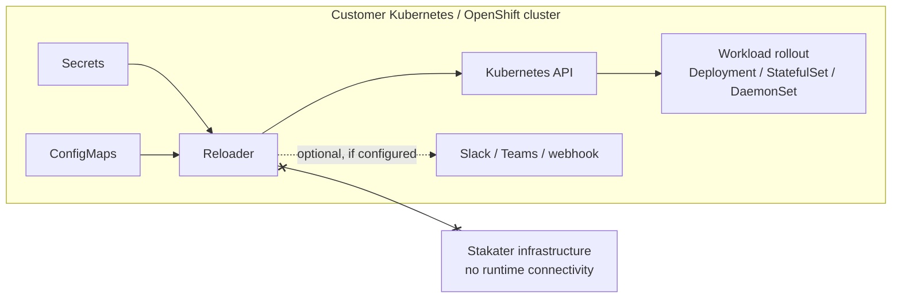
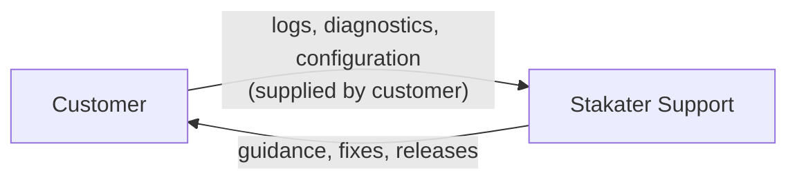

# Reloader Enterprise Security & Compliance

This page describes the security posture of Reloader Enterprise for security teams, procurement reviewers, and third-party risk assessments. It covers the deployment model, data handling, network requirements, air-gapped operation, supply-chain security, and failure behavior.

Everything on this page applies to Reloader Enterprise deployed in your own Kubernetes, OpenShift, AKS, EKS, or Rancher clusters. Reloader Enterprise is not a SaaS product — there is no Stakater-hosted component.

---

## Third-party risk assessment quick reference

| Question | Reloader Enterprise |
|---|---|
| Customer-hosted? | Yes — runs entirely inside your cluster |
| SaaS or vendor-hosted component? | No |
| Requires Stakater access to your environment? | No |
| Requires Kubernetes API access? | Yes — read Secrets/ConfigMaps, patch workloads |
| Reads Kubernetes Secrets? | Yes, within its configured scope |
| Sends Secret or ConfigMap data to Stakater? | No |
| Stores customer application data? | No |
| Mandatory internet connectivity at runtime? | No* |
| Air-gapped operation supported? | Yes |
| Uses AI or machine learning? | No |
| In the application data path? | No |
| Do workloads stop if Reloader fails? | No |
| Signed Enterprise images? | Yes — Cosign, publicly verifiable |
| Per-release artifact digests published? | Yes |
| Release-gated CVE scanning? | Yes — releases fail on HIGH/CRITICAL findings |
| Commercial support and SLA? | Yes |
| High availability supported? | Yes |

*Except optional integrations you configure yourself, such as Slack, Teams, or webhook notifications.

---

## Deployment model

Reloader Enterprise is **customer-hosted software**:

- It runs as a controller inside your Kubernetes or OpenShift cluster, installed via Helm.
- There is no Stakater-operated control plane, agent, or SaaS backend.
- Normal operation does not require Stakater personnel to access your systems, network, or data.
- Stakater's only distribution touchpoint is the container registry you pull release artifacts from — and in air-gapped environments, even that is replaced by your internal registry (see [Air-gapped operation](#air-gapped-operation)).

---

## Architecture and data flow



Reloader watches Secrets and ConfigMaps through the Kubernetes API, detects changes, and patches the pod template of workloads that reference them, triggering a standard Kubernetes rolling update. All processing happens inside the cluster.

See [How Reloader works](../architecture/how-it-works.md) for the full mechanism.

---

## Data access and data handling

Reloader watches Kubernetes Secrets and ConfigMaps **within its configured scope** through the Kubernetes API. This access is required to detect changes and determine which workloads need a rollout.

The following statements are verified against the Reloader source code (Enterprise images are built from the same audited source):

- Secret and ConfigMap data is processed **in memory, inside your cluster**, and is **never transmitted to Stakater** or any other external party. The only outbound connections in the codebase are to the Kubernetes API and to notification webhooks you explicitly configure.
- Reloader does **not persist** Secret or ConfigMap values to disk or to any datastore. Change detection computes a hash over resource data and compares hashes; there are no file-write calls in the production code.
- Reloader does **not write Secret values to its logs or notifications**. Log output and webhook alert messages reference resource names, types, and namespaces — never contents.
- Reloader does **not store customer application data**. It is stateless; all state it needs lives in the Kubernetes resources themselves.

Access can be narrowed with namespace scoping, namespace and resource label selectors, or by ignoring Secrets or ConfigMaps entirely — see [Namespace scoping](../how-to-guides/namespace-scoping.md) and the [RBAC & Security reference](../reference/rbac.md).

---

## RBAC and least privilege

Reloader runs under a dedicated ServiceAccount with an explicitly defined role. The exact rules created by the Helm chart:

| Resource | Verbs | Purpose |
|---|---|---|
| `secrets` | get, list, watch | Detect changes (read-only) |
| `configmaps` | get, list, watch | Detect changes (read-only) |
| `deployments`, `statefulsets`, `daemonsets` | get, list, update, patch | Trigger rolling restart |
| `cronjobs` | get, list | Evaluate CronJob workloads |
| `jobs` | create, delete, list, get | CronJob restart mechanism (create the Job, clean it up) |
| `events` | create, patch | Emit audit-visible Kubernetes Events |
| `namespaces` | get, list, watch | Only when `namespaceSelector` is used |
| `secretproviderclasses`, `secretproviderclasspodstatuses` | get, list, watch | Only when Secrets Store CSI integration is enabled (read-only) |
| `configmaps` (Reloader's own namespace only) | get, list, watch, create, update | Internal operational metadata, confined to the deployment namespace |
| `leases` (Reloader's own namespace only) | create; get/update on Reloader's lock only | Only in HA mode — leader election, restricted by `resourceNames` |
| `rollouts` (argoproj.io) | get, list, update, patch | Only when Argo Rollouts support is enabled |
| `deploymentconfigs` (OpenShift) | get, list, update, patch | Only when OpenShift support is enabled |

Key least-privilege properties:

- **Watched Secret and ConfigMap access is read-only.** Across all watched namespaces, Reloader never writes configuration or secret data. The only ConfigMap write permission it holds is confined to its own deployment namespace, for internal metadata.
- **Cluster-wide or namespace-scoped.** With `watchGlobally: false`, Reloader uses namespace-scoped `Role` resources instead of a `ClusterRole` — either its own namespace only, or an explicit list of selected namespaces (one Role per namespace, no cluster-wide permissions).
- **Scope can be restricted further** to selected namespaces and selected resources via label selectors.
- **Optional rules are omitted when unused** — HA, Argo Rollouts, OpenShift, and namespace-selector rules are only added when the corresponding feature is enabled.
- **Chart-managed RBAC can be disabled** entirely if your organization provisions RBAC through its own pipeline.

Full details, including the exact YAML rules and verification commands: [RBAC & Security reference](../reference/rbac.md).

---

## Network requirements

Reloader's connectivity requirements are minimal and differ by phase:

| Phase | Connectivity | Direction |
|---|---|---|
| Installation / upgrade | Pull images and Helm chart from the Enterprise registry (`ghcr.io`), **or from your internal mirror** | Outbound, customer-initiated |
| Runtime | Kubernetes API server only | In-cluster |
| Metrics | Prometheus scrapes Reloader on port 9090 | Inbound, in-cluster |
| Notifications (optional) | Slack / Teams / webhook endpoints, only if you configure them | Outbound |
| Support | None — no persistent or standing connection to Stakater | — |

**There is no mandatory runtime connectivity to Stakater infrastructure or the internet.** Reloader does not phone home, and there is no license-activation callback or telemetry at runtime. This is verified against the source: Enterprise images are built directly from the tagged open-source Reloader codebase, whose only outbound calls are to the Kubernetes API and customer-configured webhooks. Enterprise licensing is enforced through registry access credentials at install time, not through runtime checks.

The Helm chart ships an optional `NetworkPolicy` that restricts the pod to exactly this profile — ingress on the metrics port, egress to the Kubernetes API only. See [Network policy](../reference/rbac.md#network-policy).

---

## Air-gapped operation

Reloader Enterprise is designed to run in **fully air-gapped and disconnected environments** — common in energy, defense, finance, and other regulated sectors.

- **Pull-based distribution.** Enterprise images and charts are pulled by you from the registry; Stakater never pushes into your environment.
- **Mirror and run offline.** Mirror the Enterprise container image (standard or UBI variant) and Helm chart into your internal registry (Artifactory, Harbor, Nexus, ACR, ECR, Quay), then install with `image.repository` pointing at your mirror. Every release publishes an immutable SHA256 digest so you can mirror and verify by digest rather than tag.
- **No runtime callbacks.** Because Reloader has no phone-home, telemetry, or license-server dependency, it operates indefinitely without internet access.
- **Offline upgrades.** Upgrades follow the same mirror-then-install flow; release artifacts, SBOMs, and digests are published per version on the [versions page](../versions.md).

<!-- VERIFY (engineering): confirm supported offline chart delivery (helm pull / OCI chart in registry) and document exact mirroring commands in the install guide. -->

---

## Container and pod security

The Helm chart's default pod security context:

```yaml
securityContext:
  runAsNonRoot: true
  runAsUser: 65534        # 'nobody' — no special privileges
  seccompProfile:
    type: RuntimeDefault
```

Recommended production hardening baseline on top of the defaults:

```yaml
reloader:
  readOnlyRootFileSystem: true
  deployment:
    containerSecurityContext:
      allowPrivilegeEscalation: false
      capabilities:
        drop:
          - ALL
  netpol:
    enabled: true
```

With this configuration Reloader runs as a non-root, non-privileged container with all capabilities dropped, a read-only root filesystem (the chart automounts an `emptyDir` at `/tmp` for scratch space), the runtime-default seccomp profile, and a NetworkPolicy restricting traffic to the metrics port and the Kubernetes API.

Reloader also runs cleanly under the Kubernetes `restricted` Pod Security Standard and OpenShift's `restricted-v2` SCC (with `runAsUser: null` so OpenShift assigns the UID — see the [OpenShift guide](../how-to-guides/use-reloader-with-openshift.md)).

<!-- VERIFY (engineering): confirm restricted PSS / restricted-v2 SCC compatibility claim; consider making the hardened baseline the Enterprise chart default. -->

---

## Software supply-chain security

Reloader Enterprise images are built and maintained under a hardened release process:

- **Release-gated CVE scanning** — both the standard and UBI images are scanned with Trivy during the release pipeline, and the release **fails** on HIGH or CRITICAL findings (including unfixed ones); an Enterprise release cannot ship with known critical vulnerabilities
- **Cosign-signed images** — both image variants are signed with Sigstore Cosign (keyless, GitHub OIDC identity, recorded in the public Rekor transparency log), and signature verification runs as a release gate
- **Immutable SHA256 digests** published per release on the [versions page](../versions.md), so deployments can pin and verify by digest
- **UBI variant** (Red Hat Universal Base Image) for environments that mandate Red Hat-certified base images
- **Backported security fixes** across supported versions — you are not forced to the latest release to receive a fix

### Verifying image signatures

```bash
cosign verify \
  ghcr.io/stakater/reloader-enterprise:<version> \
  --certificate-oidc-issuer "https://token.actions.githubusercontent.com" \
  --certificate-identity-regexp 'https://github\.com/stakater-ab/reloader-enterprise/.*'
```

The signature is keyless: the certificate identity is the Stakater release workflow, and the signature is recorded in the public Rekor transparency log, so provenance can be verified without distributing keys — including inside air-gapped environments after mirroring.

<!-- VERIFY (product): the per-release "SBOM" on the versions page is currently an artifact digest manifest, not a component-level SBOM. Either add SBOM generation (e.g. syft) to the enterprise release pipeline or keep the softer digest wording here and in the quick-reference table. -->

---

## Vulnerability management

<!-- VERIFY (product): the advisory/notification/reporting/SLA statements below need business confirmation — the scanning and backport statements are verified. -->

- **Scanning** — every Enterprise release is scanned with Trivy across OS packages and application dependencies, and the release pipeline blocks on HIGH or CRITICAL findings.
- **Classification** — findings are triaged by severity (CVSS) and exploitability in the context of how Reloader runs.
- **Remediation** — fixes ship as patch releases; security and critical fixes are **backported to supported versions**, not only the latest.
- **Advisories** — customers are notified of security-relevant releases through the Enterprise support channel.
- **Reporting** — suspected vulnerabilities can be reported to Stakater through the [support channel](../help.md); coordinated disclosure is followed.

Support and response times are covered by the Enterprise SLA — see [OSS vs Enterprise](../about/editions.md).

---

## Availability and failure impact

Reloader is **not in the application data path**. It does not proxy, intercept, or process application traffic, and workloads do not depend on it at runtime.

If Reloader becomes unavailable:

- **Existing workloads continue running, unaffected.** Nothing stops, degrades, or restarts.
- ConfigMap and Secret changes simply stop triggering automatic rollouts until Reloader is restored — or until you perform the rollout manually (`kubectl rollout restart`).
- Reloader is stateless: restarting or reinstalling it restores full function with no recovery procedure or data restore.

For higher assurance, Reloader supports **high-availability mode** — multiple replicas with leader election, so a standby takes over if the active instance fails.

This failure profile means the operational and business-continuity impact of a Reloader outage is limited to delayed configuration propagation, not service disruption.

---

## Regulatory and critical-infrastructure environments

Reloader itself does not determine the regulatory classification of the workloads or environments in which it is deployed. Customers are responsible for determining whether a given deployment falls within NERC-CIP, SOX, PCI DSS, HIPAA, nuclear export control (10 CFR Part 810), ICS/OT, or other regulated scopes.

Architectural facts relevant to such assessments:

- Reloader is general-purpose Kubernetes infrastructure software. It contains no nuclear-related technology and is not itself an Industrial Control System, Operational Technology, or Building Management System component.
- It runs entirely within your infrastructure, with no vendor connectivity, which typically simplifies assessments for isolated and regulated network zones.
- Air-gapped operation, UBI-based images, SBOMs, image signing, and least-privilege RBAC support deployment in environments with strict compliance controls.

---

## AI usage

Reloader does **not** use artificial intelligence, machine learning, large language models, natural-language processing, or automated AI-based decision-making. All behavior is deterministic: changes are detected by comparing resource data, and rollouts are triggered by explicit annotation-driven rules.

---

## Support access model

Stakater personnel do **not** require standing or persistent access to customer clusters or data.

Support is customer-initiated and works on artifacts you choose to share:



If a support case would ever benefit from interactive access (for example, a screen-share session), it is customer-controlled, time-bounded, and separately authorized — never assumed or standing.

---

## Business continuity

- **Self-hosted software, not a managed service.** Day-to-day operation of Reloader does not depend on Stakater staffing or infrastructure availability.
- **A Stakater outage has no effect on running deployments.** The only Stakater dependency is pulling new releases — and mirrored/air-gapped installations remove even that.
- **Source continuity.** Reloader Enterprise is built on the open-source Reloader project, which is publicly available and widely adopted; the core reload capability is not proprietary lock-in.

---

## Questions

If your security or procurement team needs information beyond this page — completed questionnaires, countersigned statements, or architecture review sessions — [contact us](../help.md).
